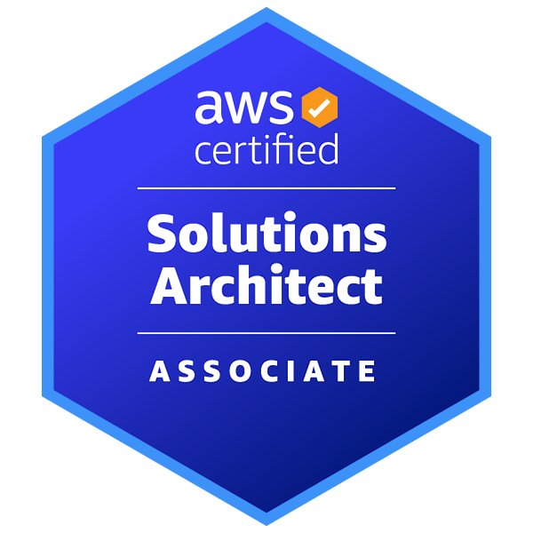
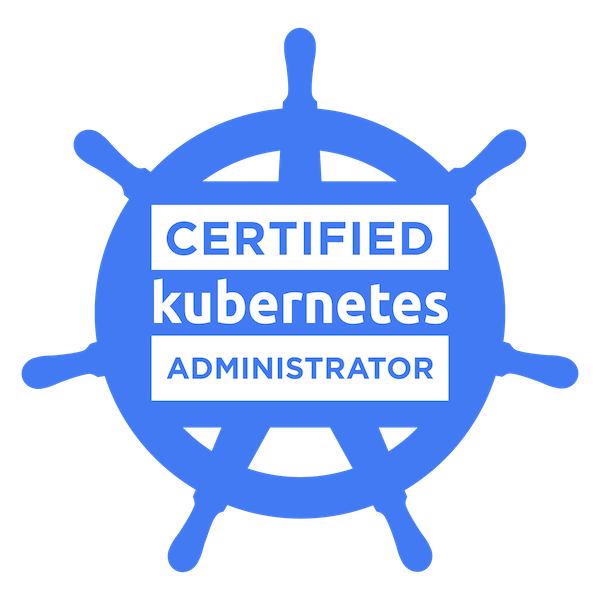

# 🎓 Certifications

I believe credibility comes from curiosity, discipline, and verifiable proof of learning.  
Below are the certifications I’ve earned so far — focused on software engineering, databases, and DevOps/cloud foundations.

---

## 🌟 Core Certifications (Most Relevant to DevOps / SRE)

### ☁️ AWS Certified Solutions Architect – Associate (SAA)

**Issuer:** Amazon Web Services (AWS)  
**Date:** Jun 13, 2026  
**Expires:** Jun 13, 2029  
**Validation Number:** (available upon request)

Focus areas:

- Designing resilient cloud architectures
- Designing high-performing architectures
- Designing secure applications and infrastructure
- Designing cost-optimized architectures
- AWS networking (VPC, Route 53, ELB)
- Compute (EC2, ECS, EKS, Lambda)
- Storage (S3, EBS, EFS)
- Databases (RDS, DynamoDB)
- Identity & Access Management (IAM)
- Monitoring & Operational Excellence (CloudWatch, CloudTrail)

> Passed the official AWS Certified Solutions Architect – Associate exam.

🔗 Verify: https://www.credly.com/badges/c507069b-8dee-4171-935d-f4a6c7b89df3

### 🛠️ Certified Kubernetes Administrator (CKA)
**Issuer:** The Linux Foundation  
**Date:** Nov 8, 2025  
**Expires:** Nov 8, 2027  
**Certificate ID:** (available upon request)

Focus areas:

- Kubernetes architecture
- Scheduling, networking, storage
- Deployments & troubleshooting
- Security, RBAC, cluster maintenance
- Backup/restore, upgrades, disaster handling

> Passed the official hands-on lab exam.

🔗 Verify: https://www.credly.com/badges/55215e6e-42f5-4366-840e-ec926baea550/public_url

---

## 📜 National & Professional Certifications

### Information Processing Craftsman Certificate  
**Issuer:** Ministry of Science and ICT, Republic of Korea  
**Administered by:** HRD Korea

Covers:

- Software development lifecycle
- Database design and normalization
- Algorithms and data structures
- Systems analysis and problem-solving

---

## 💻 Programming & Development (freeCodeCamp)

These demonstrate consistency and strong fundamentals.

### Foundational C# with Microsoft
### Relational Database
### Data Visualization
### Back End Development & APIs
### Front End Development Libraries
### JavaScript Algorithms & Data Structures
### Responsive Web Design

Each certification included:

- projects
- assessments
- hands-on problem solving

Links to project repos will gradually be added as I clean and publish them.

---

## 🔍 Verification

Most certifications can be verified upon request.  
Public verification links and digital badges will be added once available.

If needed, please contact me through GitHub or LinkedIn.

---

