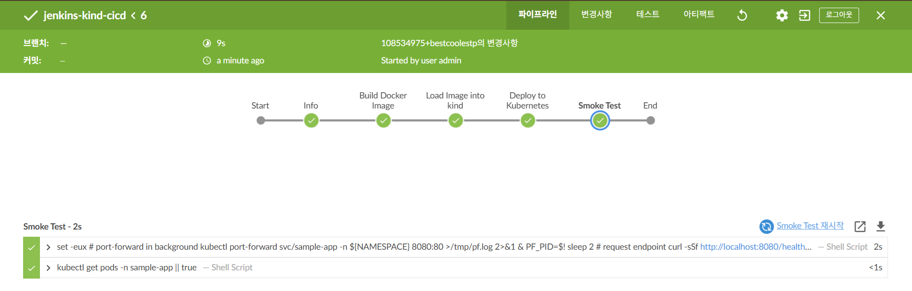

# CI/CD Projects

This folder contains hands‑on case studies demonstrating different CI/CD setups.

---

## Jenkins → kind → Kubernetes CI/CD (Local Case Study)

A minimal but complete CI/CD loop that shows reproducible delivery and operational validation:

1. Build a container image  
2. Load it into a local Kubernetes cluster (kind)  
3. Deploy Kubernetes manifests  
4. Verify with an automated smoke test

**Highlights:**
- GitHub push triggers Jenkins Pipeline
- Docker image built and loaded into kind
- Kubernetes manifests applied with rollout status check
- Smoke test via port‑forward and `/health` endpoint

📂 Repo: [`ci-cd/jenkins-kind-cicd`](./jenkins-kind-cicd)  
📸 Proof: 

---

