# Terraform + Ansible on AWS: EC2 Infrastructure & Configuration

**Project 3 – DevOps Portfolio**

## Overview

This project demonstrates a **complete Infrastructure-as-Code lifecycle on AWS**, using:

* **Terraform** for infrastructure provisioning
* **Ansible** for post-provision host configuration
* **Docker** to deploy a containerized web workload

The focus is on **separation of concerns**, **security**, and **reproducibility**, rather than one-click tutorials.

---

## Architecture

**Provisioned with Terraform**

* Custom VPC (`10.10.0.0/16`)
* Public subnet
* Internet Gateway & route table
* Security Group

  * SSH (22): restricted to my IP
  * HTTP (80): open for demo
* Ubuntu 22.04 EC2 instance
* Terraform outputs for SSH and public IP

**Configured with Ansible**

* SSH-based access using key authentication
* Docker installation
* NGINX demo container (`nginxdemos/hello`) exposed on port 80

---

## Workflow

1. Terraform initializes provider and configuration
2. Terraform plans and applies AWS infrastructure
3. Infrastructure verified via AWS Console
4. SSH connectivity validated
5. Ansible configures the EC2 instance
6. Web application verified via browser
7. Infrastructure destroyed to avoid cloud cost

---

## Terraform – Infrastructure Provisioning

### Initialization & Version Check

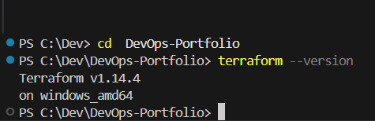
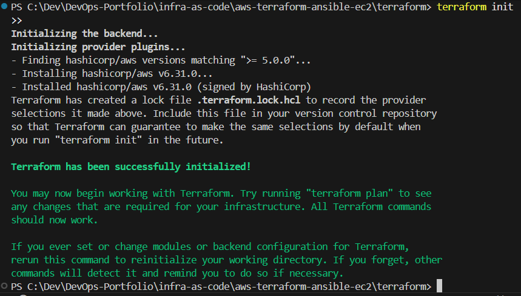

### VPC & Networking

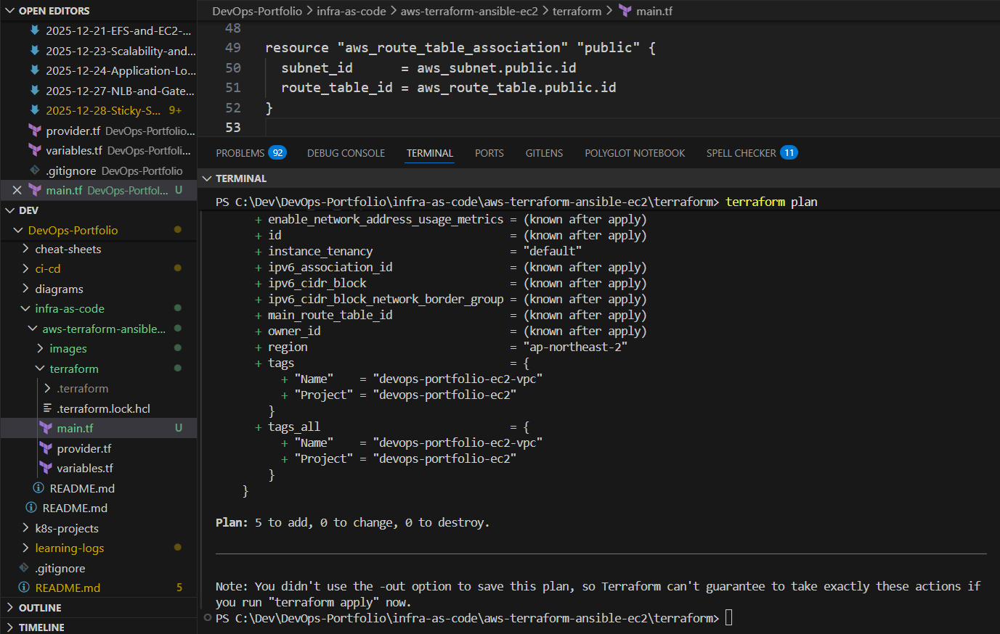
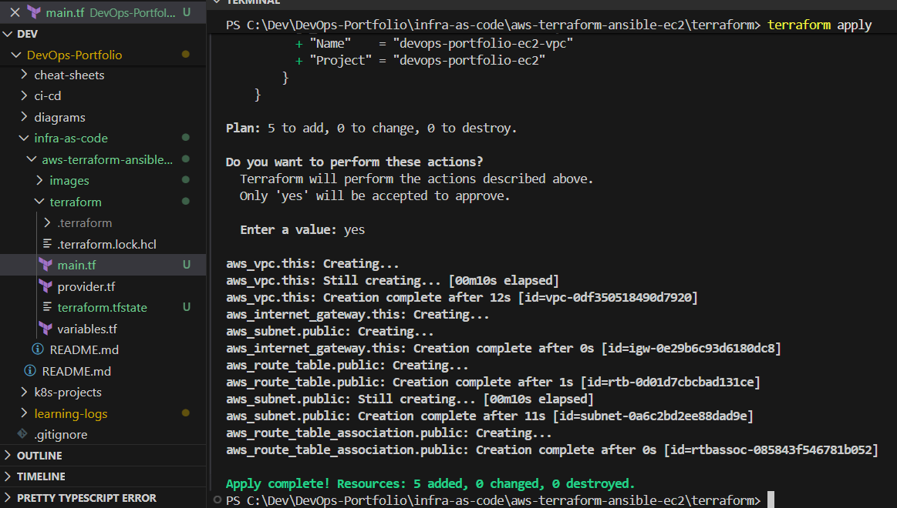
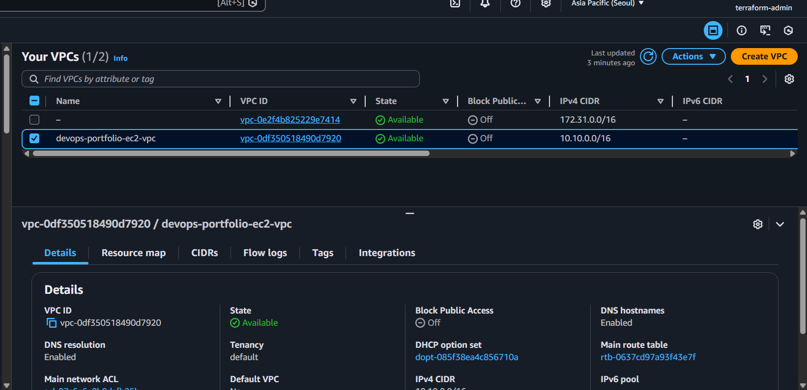

### EC2 Instance

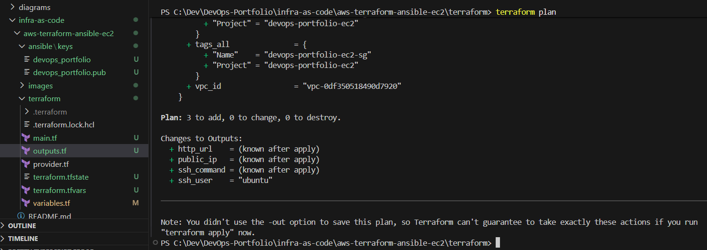
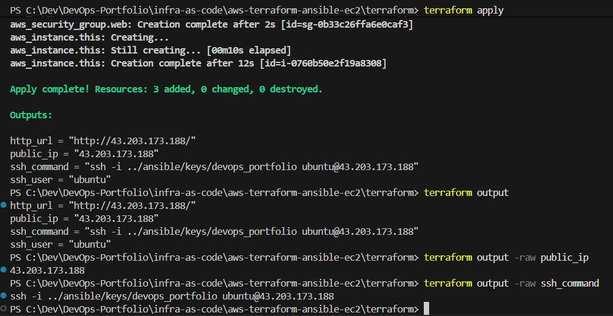

---

## SSH & Key Management

* SSH key pair generated locally
* Private key **never committed to Git**
* SSH access restricted to a single IP
* WSL used to handle Linux-compatible key permissions

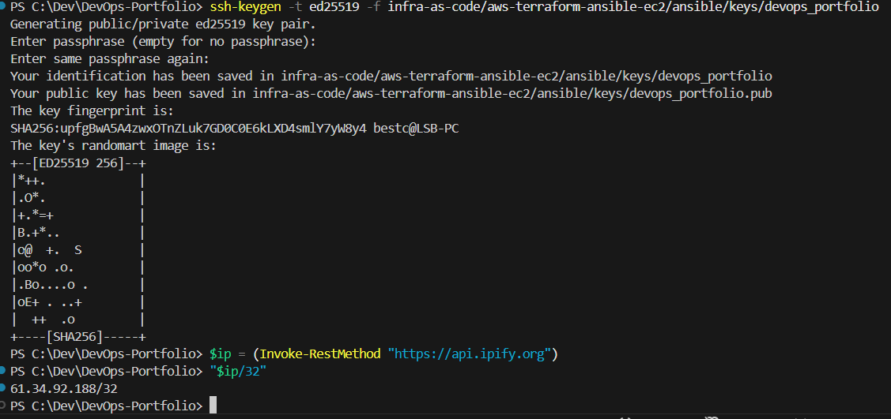
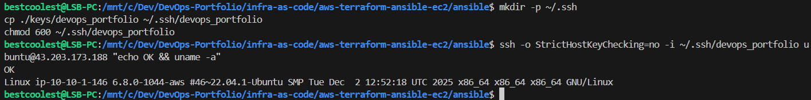
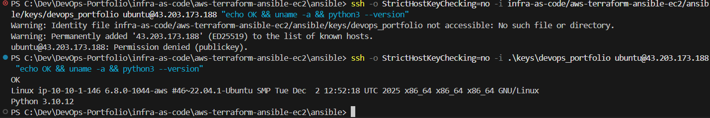

---

## Ansible – Post-Provision Configuration

Ansible is used **after Terraform completes**, reinforcing the boundary between:

* Infrastructure provisioning (Terraform)
* Host configuration (Ansible)

### Ansible Playbook Execution

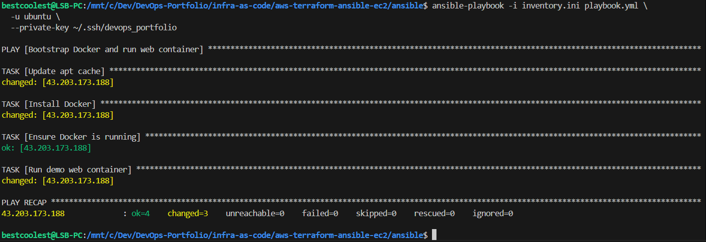

**Playbook tasks**

* Update apt cache
* Install Docker
* Start Docker service
* Run NGINX demo container on port 80

---

## Application Verification

Successful deployment of the containerized web application:

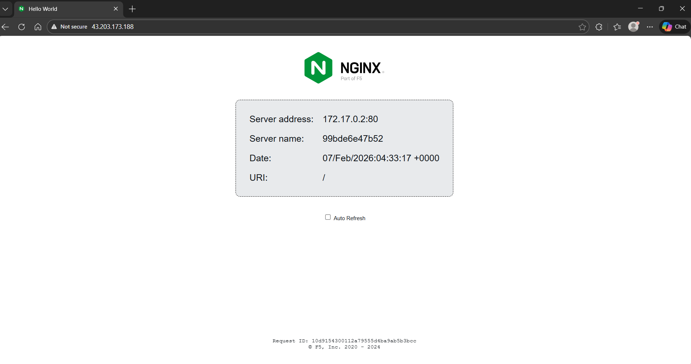

This confirms:

* Network routing is correct
* Security groups allow HTTP traffic
* Docker is running correctly
* Ansible configuration succeeded

---

## Cleanup (Cost Awareness)

All AWS resources are destroyed after verification.

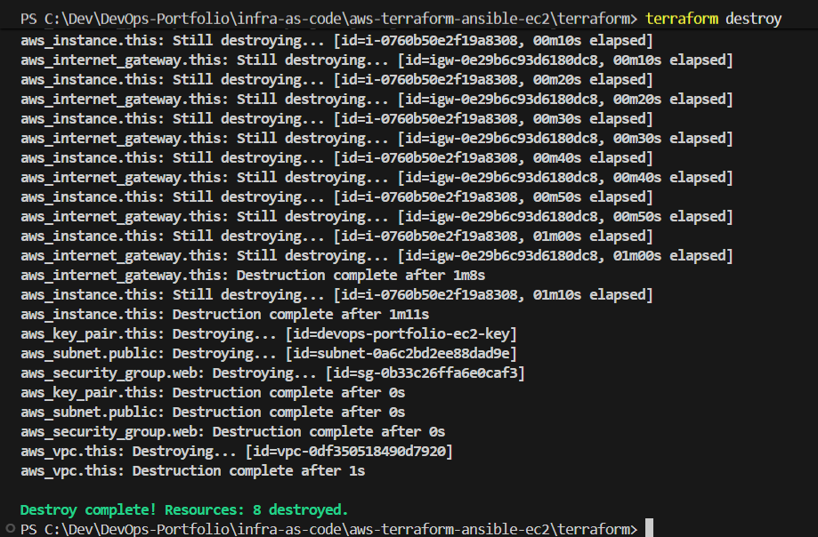

```bash
terraform destroy
```

Including cleanup demonstrates responsible cloud usage.

---

## Repository Notes

* Sensitive files are excluded:

  * `terraform.tfvars`
  * SSH private keys
* Example files are provided:

  * `terraform.tfvars.example`
  * `inventory.ini.example`
* `.terraform.lock.hcl` is committed for provider reproducibility

---

## Skills Demonstrated

* AWS VPC & EC2 fundamentals
* Terraform stateful IaC
* Secure SSH key handling
* Ansible configuration management
* Docker on cloud VMs
* WSL + Windows/Linux interoperability
* End-to-end infrastructure lifecycle management

---

## Future Improvements

* Auto-generate Ansible inventory from Terraform outputs
* Add ALB + Auto Scaling Group
* Introduce CI/CD with GitHub Actions
* Refactor Ansible into reusable roles

