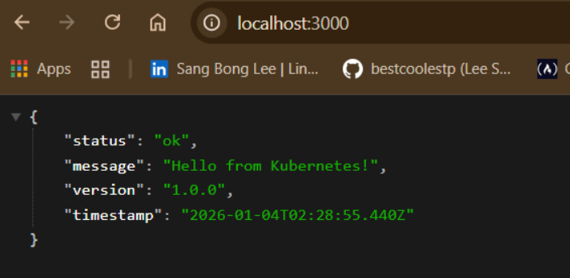
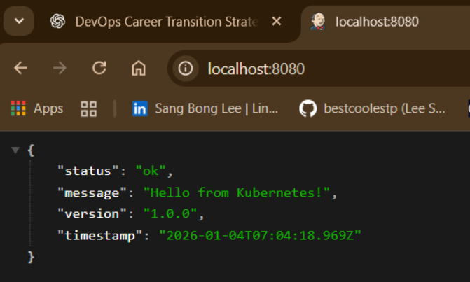

# Kubernetes Sample App Deployment (DevOps / SRE Case Study)

This project demonstrates how I take a simple application and run it **reliably** on Kubernetes — with clear, reproducible steps.

My goals:

- containerize an app
- deploy it to a Kubernetes cluster
- expose it safely
- demonstrate scaling + self-healing behavior
- document everything like an engineer handing off a runbook

---

## 🚀 Architecture

```
Client
  |
  |  (kubectl port-forward)
  |
[ Service (ClusterIP) ]
          |
[ Deployment ]
    |
[ 2 Pods ]
    |
[ Node (kind cluster) ]
```

Components:

- **Node.js app** running on port `3000`
- **Docker image** → `k8s-sample-app:1.0`
- **kind** Kubernetes cluster (local, reproducible)
- Kubernetes:
  - Namespace
  - Deployment
  - Service (ClusterIP)


## 📸 Screenshots

Local Docker container (no Kubernetes yet):


Same app running inside Kubernetes (port-forward on localhost:8080):



---

## 📦 Build & Load Application Image

Build image locally:

```bash
docker build -t k8s-sample-app:1.0 .
```

Load into the kind cluster:

```bash
kind load docker-image k8s-sample-app:1.0 --name devops-portfolio
```

Reason: kind runs its own node container — images must be loaded into it.

---

## ☸️ Kubernetes Manifests

Namespace:

```yaml
apiVersion: v1
kind: Namespace
metadata:
  name: sample-app
```

Deployment:

```yaml
apiVersion: apps/v1
kind: Deployment
metadata:
  name: sample-app
  namespace: sample-app
spec:
  replicas: 2
  selector:
    matchLabels:
      app: sample-app
  template:
    metadata:
      labels:
        app: sample-app
    spec:
      containers:
        - name: sample-app
          image: k8s-sample-app:1.0
          imagePullPolicy: IfNotPresent
          ports:
            - containerPort: 3000
          resources:
            requests:
              cpu: 100m
              memory: 64Mi
            limits:
              cpu: 250m
              memory: 128Mi
```

Service:

```yaml
apiVersion: v1
kind: Service
metadata:
  name: sample-app
  namespace: sample-app
spec:
  type: ClusterIP
  selector:
    app: sample-app
  ports:
    - name: http
      port: 80
      targetPort: 3000
```

Apply:

```bash
kubectl apply -f namespace.yaml
kubectl apply -f deployment.yaml
kubectl apply -f service.yaml
```

Verify:

```bash
kubectl get pods -n sample-app
kubectl get svc -n sample-app
```

---

## 🌐 Access the Application

Use port-forward (simple + secure):

```bash
kubectl port-forward svc/sample-app -n sample-app 8080:80
```

Visit:

```
http://localhost:8080
```

---

## 🛡️ Self-Healing Demonstration

Delete a pod:

```bash
kubectl delete pod <pod-name> -n sample-app
```

Kubernetes automatically recreates it:

```bash
kubectl get pods -n sample-app
```

➡️ Shows understanding of **replicas**, **controllers**, and reliability.

---

## 📈 Scaling Demonstration

Scale the app:

```bash
kubectl scale deployment sample-app -n sample-app --replicas=4
kubectl get pods -n sample-app
```

➡️ Demonstrates horizontal scaling behavior.

---

## 🧭 Why This Matters (DevOps / SRE Mindset)

What this project shows:

- I treat infrastructure as something **repeatable**
- I deploy applications safely
- I reason about reliability
- I validate behavior (not just “it runs”)
- I document with clarity so others can operate the system

Next steps I plan to add:

- Ingress
- Horizontal Pod Autoscaler
- CI/CD pipeline to deploy automatically

---

## ✔️ Tech Used

- Node.js
- Docker
- kind (Kubernetes in Docker)
- kubectl
- Windows 11 + WSL2

---

### 📌 Notes

This cluster is local and disposable — which is exactly how I practice:

```
kind delete cluster --name devops-portfolio
```

Then recreate whenever needed.

---


