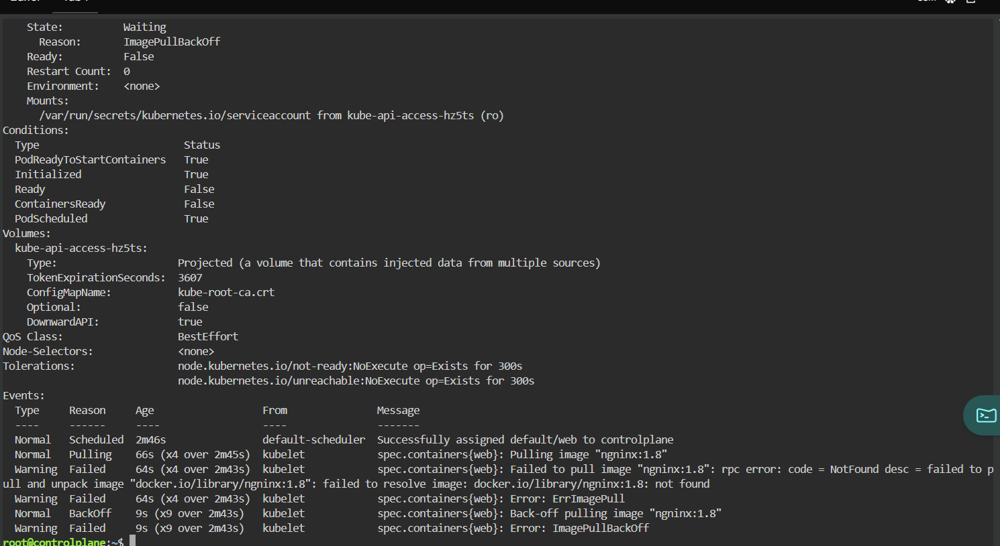
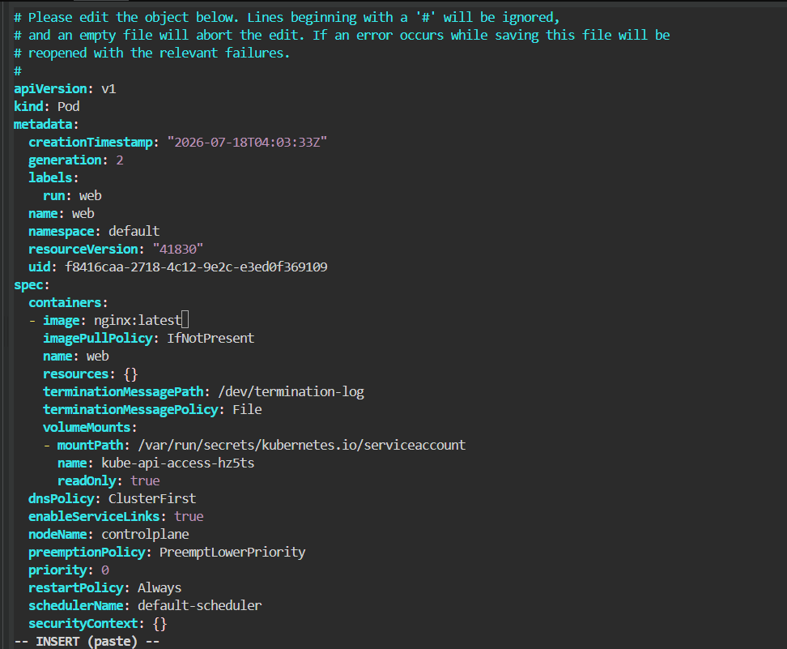
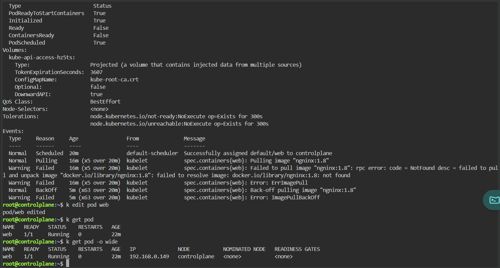

# ImagePullBackOff

## Scenario

A Pod failed to start because the specified container image could not be downloaded.

This is one of the most common Kubernetes production issues.

---

## Environment

- Kubernetes
- Killercoda Lab
- kubectl

---

## Symptoms

The Pod remained in the following state:

```
STATUS: ImagePullBackOff
```

Checking the Pod:

```bash
kubectl describe pod web
```

showed:



---

## Investigation

The Events section reported:

```
Failed to pull image "nginx:1.8"

docker.io/library/nginx:1.8 not found
```

This immediately suggested that the image tag was invalid.

---

## Root Cause

The Deployment referenced a non-existent container image.

```yaml
image: nginx:1.8
```

---

## Resolution

Edited the Pod:

```bash
kubectl edit pod web
```

Changed

```yaml
image: nginx:1.8
```

to

```yaml
image: nginx:latest
```



---

## Verification

Verified the Pod became healthy.

```bash
kubectl get pod
```

Result:

```
READY   STATUS
1/1     Running
```



---

## Commands Used

```bash
kubectl get pod

kubectl describe pod web

kubectl edit pod web

kubectl get pod -o wide
```

---

## Lessons Learned

- Always inspect the Events section first.
- ImagePullBackOff usually indicates:
  - incorrect image name
  - incorrect tag
  - authentication failure
  - private registry issues
- `kubectl describe` is often enough to identify the root cause.