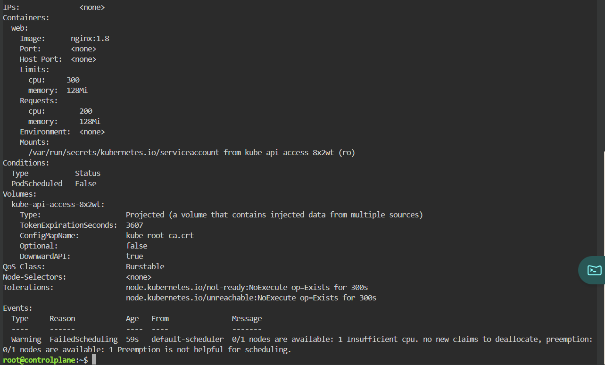
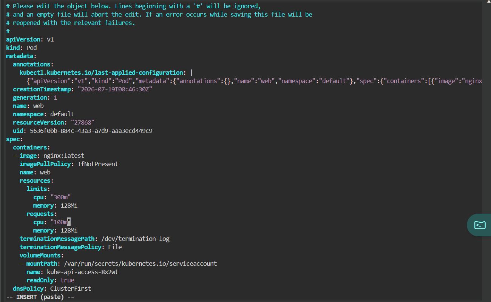
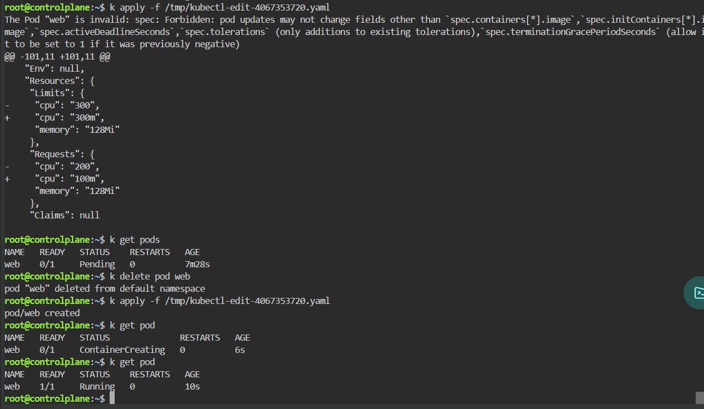

# Pending Pod - Insufficient CPU

## Scenario

A Pod remained in the Pending state because the Kubernetes scheduler could not find a node with sufficient CPU resources.

---

## Environment

- Kubernetes
- Killercoda
- kubectl

---

## Symptoms

```
STATUS: Pending
```

```
kubectl get pods
```

---

## Investigation

```
kubectl describe pod web
```

Events

```
0/1 nodes are available

Insufficient cpu
```



---

## Root Cause

The Pod requested more CPU than the cluster could currently allocate.

```
resources:

  requests:

    cpu: 200m

  limits:

    cpu: 300m
```

The scheduler therefore kept the Pod in the Pending state.

---

## Initial Attempt

I attempted to modify the running Pod using

```bash
kubectl edit pod web
```

However Kubernetes rejected the update because resource requests cannot be modified on an existing Pod.

```
pod updates may not change fields...
```



---

## Resolution

Deleted the Pod

```bash
kubectl delete pod web
```

Recreated it with reduced CPU requests

```
requests:

  cpu: 100m
```

---

## Verification

```
kubectl get pod
```

Result

```
Running
```



---

## Commands Used

```bash
kubectl get pod

kubectl describe pod web

kubectl edit pod web

kubectl delete pod web

kubectl apply -f pod.yaml
```

---

## Lessons Learned

- Pending Pods are scheduler issues.
- Always inspect Events.
- Resource requests directly influence scheduling.
- Pods are mostly immutable.
- Resource changes usually require recreating the Pod.