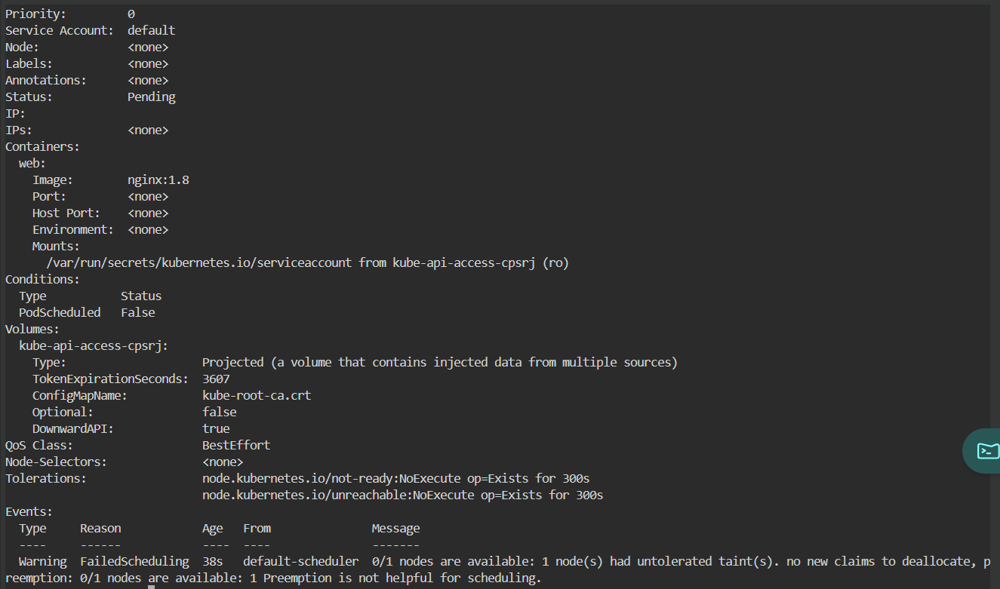
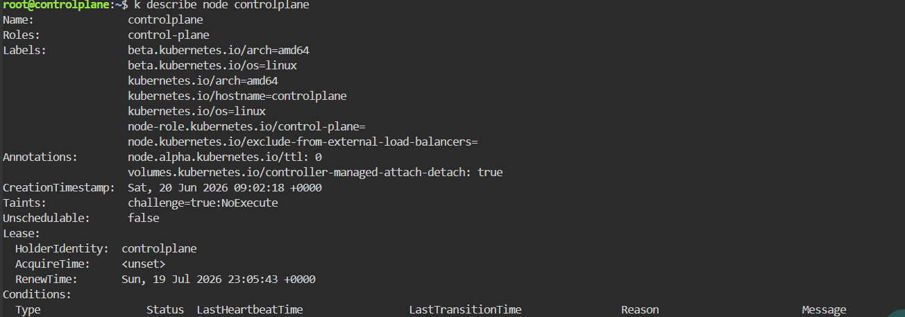
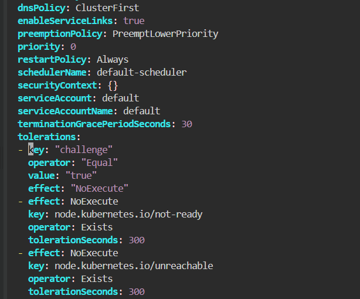
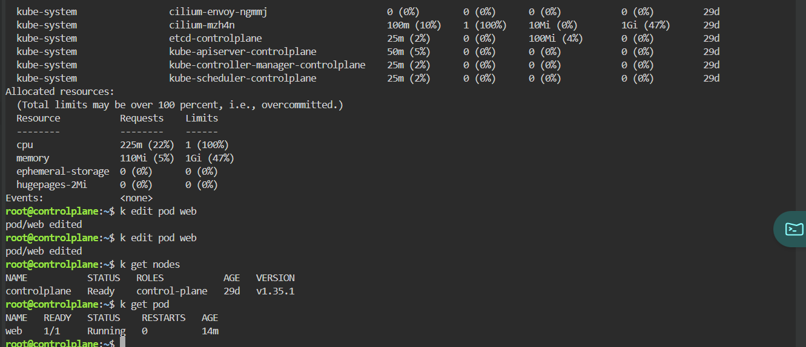

# Pending Pod - Untolerated Taint

## Scenario

A Pod remained in the Pending state because the target node had a taint that the Pod did not tolerate.

---

## Environment

- Kubernetes
- Killercoda
- kubectl

---

## Symptoms

```
STATUS: Pending
```

```
kubectl get pods
```

---

## Investigation

```
kubectl describe pod web
```

Events

```
0/1 nodes are available:

1 node(s) had untolerated taint.
```



Inspect the node

```
kubectl describe node controlplane
```

Found

```
Taints:

challenge=true:NoExecute
```



---

## Root Cause

The control-plane node was tainted.

```
challenge=true:NoExecute
```

The Pod did not contain a matching toleration.

Because the scheduler could not find a node that satisfied the scheduling requirements, the Pod remained in the `Pending` state.

---

## Resolution

Edit the Pod.

```bash
kubectl edit pod web
```

Add the following toleration.

```yaml
tolerations:
- key: challenge
  operator: Equal
  value: "true"
  effect: NoExecute
```



---

## Verification

```
kubectl get pod
```

Result

```
Running
```



---

## Commands Used

```bash
kubectl get pod

kubectl describe pod web

kubectl describe node controlplane

kubectl edit pod web

kubectl get nodes
```

---

## Lessons Learned

- Pending Pods are often scheduler-related.
- Always inspect Events with `kubectl describe pod`.
- Verify node taints using `kubectl describe node`.
- Pods require matching tolerations to be scheduled onto tainted nodes.
- Understand the difference between `NoSchedule` and `NoExecute`.