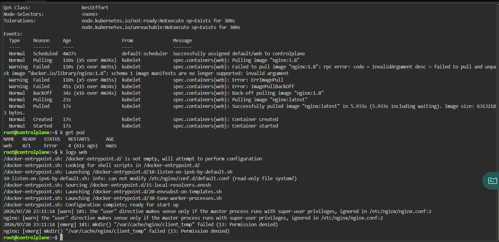
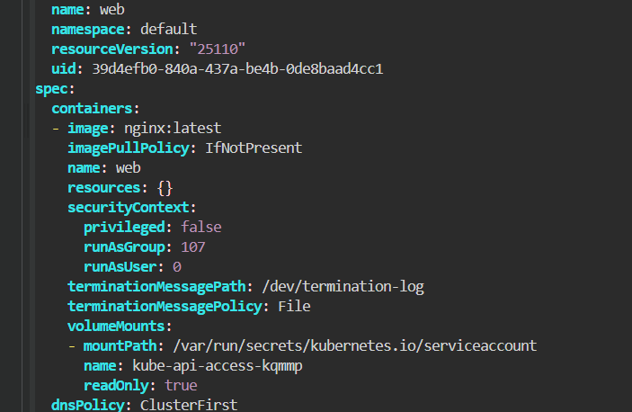
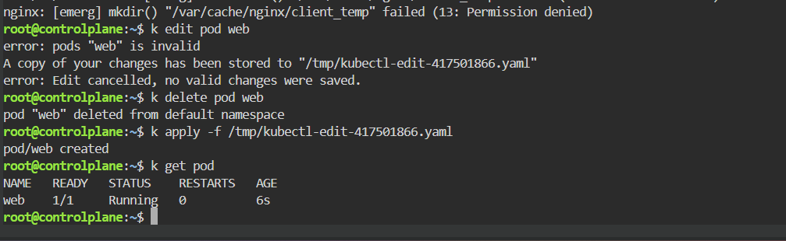

# CrashLoopBackOff - Nginx Permission Denied

## Scenario

An Nginx Pod repeatedly failed after starting because the container was configured to run with an invalid security context.

The container process attempted to create files under `/var/cache/nginx`, but the configured user did not have permission to write to that directory.

---

## Environment

- Kubernetes
- Killercoda
- kubectl
- Nginx

---

## Symptoms

The Pod was repeatedly restarting.

```bash
kubectl get pod
```

Result

```text
NAME   READY   STATUS   RESTARTS
web    0/1     Error    4
```

The Pod had already restarted several times, indicating that the container process was failing after startup.

---

## Investigation

Inspect the Pod events.

```bash
kubectl describe pod web
```

The image initially failed to pull because the Pod used an invalid image tag.

```text
Failed to pull image "nginx:1.8"
Error: ErrImagePull
Error: ImagePullBackOff
```

After changing the image to `nginx:latest`, the image was successfully pulled and the container started.

```text
Successfully pulled image "nginx:latest"
Container created
Container started
```

However, the container still failed.



Inspect the container logs.

```bash
kubectl logs web
```

The relevant error was:

```text
nginx: [emerg] mkdir() "/var/cache/nginx/client_temp" failed
(13: Permission denied)
```

---

## Root Cause

The Pod security context contained conflicting user settings.

```yaml
securityContext:
  privileged: false
  runAsGroup: 107
  runAsUser: 0
```

The Nginx startup logs also showed:

```text
the "user" directive makes sense only if the master process
runs with super-user privileges
```

The container could not create the required temporary directory:

```text
/var/cache/nginx/client_temp
```

As a result, the Nginx process terminated and Kubernetes repeatedly restarted the container.

---

## Initial Attempt

I attempted to modify the existing Pod.

```bash
kubectl edit pod web
```

Kubernetes rejected the update.

```text
error: pods "web" is invalid
error: Edit cancelled, no valid changes were saved.
```

A copy of the modified Pod manifest was saved automatically.

```text
/tmp/kubectl-edit-417501866.yaml
```

This occurred because most Pod specification fields, including container security settings, cannot be modified after the Pod has been created.

---

## Resolution

Delete the existing Pod.

```bash
kubectl delete pod web
```

Recreate the Pod using the corrected manifest saved by `kubectl edit`.

```bash
kubectl apply -f /tmp/kubectl-edit-417501866.yaml
```

The security context was corrected so that Nginx could access its required directories.



---

## Verification

Check the Pod status.

```bash
kubectl get pod
```

Result

```text
NAME   READY   STATUS    RESTARTS   AGE
web    1/1     Running   0          6s
```



The Pod started successfully without additional restarts.

---

## Commands Used

```bash
kubectl get pod

kubectl describe pod web

kubectl logs web

kubectl edit pod web

kubectl delete pod web

kubectl apply -f /tmp/kubectl-edit-417501866.yaml
```

---

## Lessons Learned

- `kubectl describe pod` reveals scheduling, image-pull, and container lifecycle events.
- `kubectl logs` is essential when a container starts but immediately exits.
- `ImagePullBackOff` and application startup failures can occur sequentially in the same troubleshooting scenario.
- A container image being successfully pulled does not mean the application will run successfully.
- Linux file permissions and Kubernetes security contexts directly affect container startup.
- Most Pod specification fields are immutable.
- Changes to container security settings generally require deleting and recreating the Pod.

---

## Key Kubernetes Concepts

- CrashLoopBackOff
- Container Logs
- Security Context
- Linux File Permissions
- Pod Immutability
- Container Restart Policy