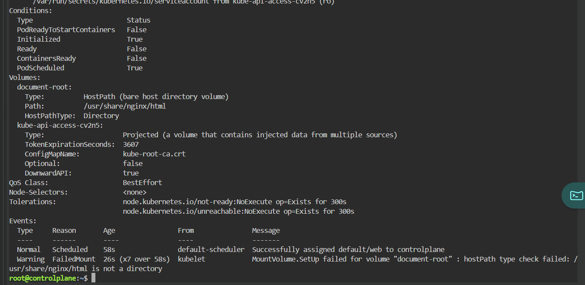
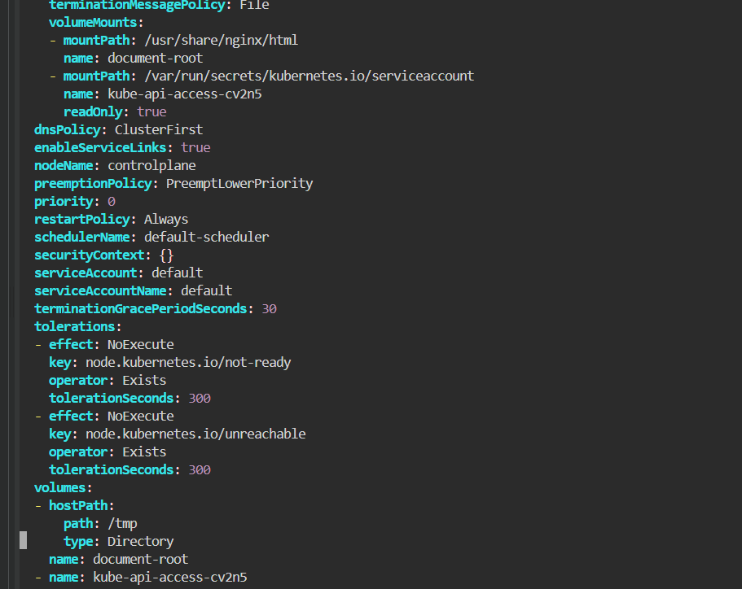
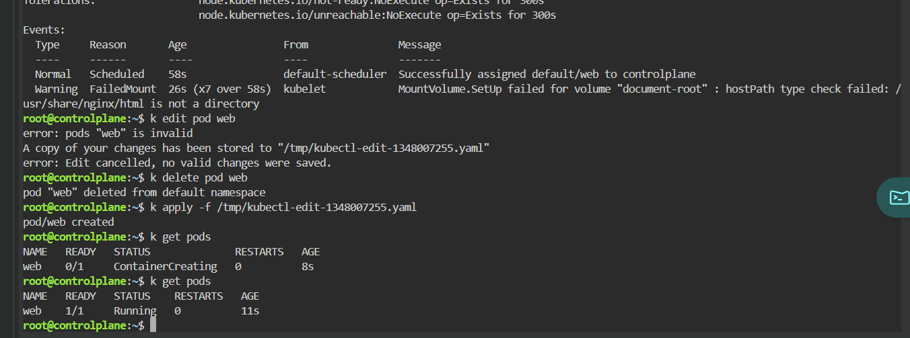

# ContainerCreating - hostPath Is Not a Directory

## Scenario

A Pod remained in the `ContainerCreating` state because Kubernetes could not mount a `hostPath` volume.

The volume expected the host path to be a directory, but the configured path was not a valid directory.

---

## Environment

- Kubernetes
- Killercoda
- kubectl
- Nginx

---

## Symptoms

The Pod was scheduled but did not start.

```bash
kubectl get pods
```

Result:

```text
NAME   READY   STATUS              RESTARTS   AGE
web    0/1     ContainerCreating   0          8s
```

---

## Investigation

Inspect the Pod.

```bash
kubectl describe pod web
```

The Pod had been successfully assigned to the node:

```text
Successfully assigned default/web to controlplane
```

However, the volume mount failed:

```text
MountVolume.SetUp failed for volume "document-root":
hostPath type check failed:
/usr/share/nginx/html is not a directory
```



The volume configuration was:

```yaml
volumes:
- name: document-root
  hostPath:
    path: /usr/share/nginx/html
    type: Directory
```

The container attempted to mount the volume at:

```yaml
volumeMounts:
- name: document-root
  mountPath: /usr/share/nginx/html
```

---

## Root Cause

The `hostPath` volume used:

```yaml
type: Directory
```

This requires the path to already exist as a directory on the Kubernetes node.

The configured host path was:

```text
/usr/share/nginx/html
```

But Kubernetes detected that this path was not a directory on the host node.

As a result, the kubelet could not mount the volume, and the Pod remained in the `ContainerCreating` state.

---

## Initial Attempt

I attempted to modify the existing Pod.

```bash
kubectl edit pod web
```

Kubernetes rejected the update because the Pod volume configuration could not be modified in place.

```text
error: pods "web" is invalid
error: Edit cancelled, no valid changes were saved.
```

The modified manifest was saved automatically:

```text
/tmp/kubectl-edit-1348007255.yaml
```

---

## Resolution

I changed the `hostPath` configuration to use an existing directory on the node.

```yaml
volumes:
- name: document-root
  hostPath:
    path: /tmp
    type: Directory
```



Then I deleted the existing Pod:

```bash
kubectl delete pod web
```

I recreated it using the corrected manifest:

```bash
kubectl apply -f /tmp/kubectl-edit-1348007255.yaml
```

---

## Verification

Immediately after recreation, the Pod entered the `ContainerCreating` state while Kubernetes prepared the container:

```text
web    0/1    ContainerCreating
```

A few seconds later:

```bash
kubectl get pods
```

Result:

```text
NAME   READY   STATUS    RESTARTS   AGE
web    1/1     Running   0          11s
```



The corrected `hostPath` allowed the volume to mount successfully, and the container started normally.

---

## Commands Used

```bash
kubectl get pods

kubectl describe pod web

kubectl edit pod web

kubectl delete pod web

kubectl apply -f /tmp/kubectl-edit-1348007255.yaml
```

---

## Lessons Learned

- A Pod can be scheduled successfully but still remain in `ContainerCreating`.
- `kubectl describe pod` is the first place to inspect volume-mount failures.
- `hostPath.type: Directory` requires the path to already exist as a directory.
- The path in `hostPath.path` refers to the node filesystem, not the container filesystem.
- Pod volume definitions are generally immutable.
- Fixing volume configuration usually requires deleting and recreating the Pod.
- `ContainerCreating` is a lifecycle state, not a root cause by itself.

---

## Key Kubernetes Concepts

- ContainerCreating
- hostPath Volume
- Volume Mounts
- kubelet
- Pod Events
- Pod Immutability
- Node Filesystem