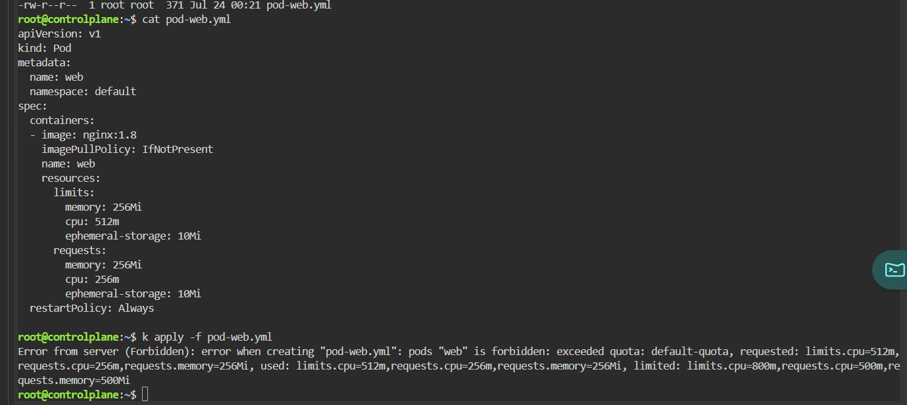
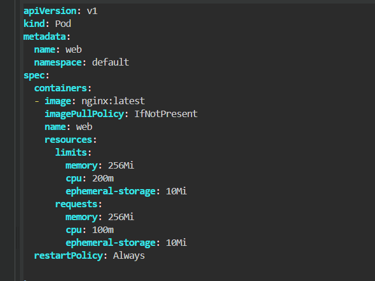
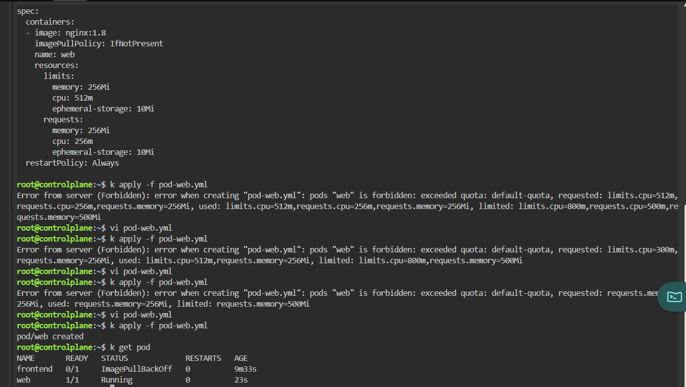

# Pod Creation - ResourceQuota Exceeded

## Scenario

A Pod could not be created because the namespace's `ResourceQuota` had already been reached.

Unlike scheduling failures, the Kubernetes API server rejected the Pod before it was created.

---

## Environment

- Kubernetes
- Killercoda
- kubectl

---

## Symptoms

Attempting to create the Pod resulted in the following error.

```bash
kubectl apply -f pod-web.yml
```

Result

```text
Error from server (Forbidden):

pods "web" is forbidden:

exceeded quota: default-quota
```

The error also showed the requested, currently used, and namespace limits.

```text
requested:
limits.cpu=512m
requests.cpu=256m
requests.memory=256Mi

used:
limits.cpu=512m
requests.cpu=256m
requests.memory=256Mi

limited:
limits.cpu=800m
requests.cpu=500m
requests.memory=500Mi
```



---

## Investigation

The namespace already contained workloads consuming part of the ResourceQuota.

The Pod requested

```yaml
resources:
  requests:
    cpu: 256m
    memory: 256Mi

  limits:
    cpu: 512m
```

Because the requested resources would exceed the namespace quota, the API server rejected the Pod before creation.

---

## Root Cause

This was **not a scheduler issue**.

The namespace ResourceQuota prevented additional resources from being allocated.

The requested resources exceeded one or more configured quota limits.

---

## Resolution

Reduced the requested resources.

Original

```yaml
requests:
  cpu: 256m

limits:
  cpu: 512m
```

Updated

```yaml
requests:
  cpu: 100m

limits:
  cpu: 200m
```



The reduced resource requests fit within the namespace quota.

---

## Verification

Apply again.

```bash
kubectl apply -f pod-web.yml
```

Result

```text
pod/web created
```

Verify.

```bash
kubectl get pod
```

Result

```text
web   1/1   Running
```



---

## Commands Used

```bash
kubectl apply -f pod-web.yml

kubectl describe resourcequota

kubectl get resourcequota

kubectl edit pod-web.yml

kubectl get pod
```

---

## Lessons Learned

- ResourceQuota is enforced by the Kubernetes API server.
- Pods may be rejected before scheduling begins.
- The error message shows three important values:
  - requested
  - used
  - limited
- Reducing requests or limits may allow Pod creation.
- Namespace quotas help prevent a single workload from consuming all cluster resources.

---

## Key Kubernetes Concepts

- ResourceQuota
- Namespace
- Requests
- Limits
- Admission Controller
- API Server Validation