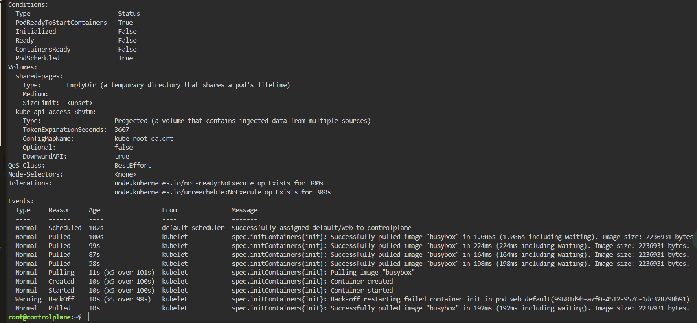
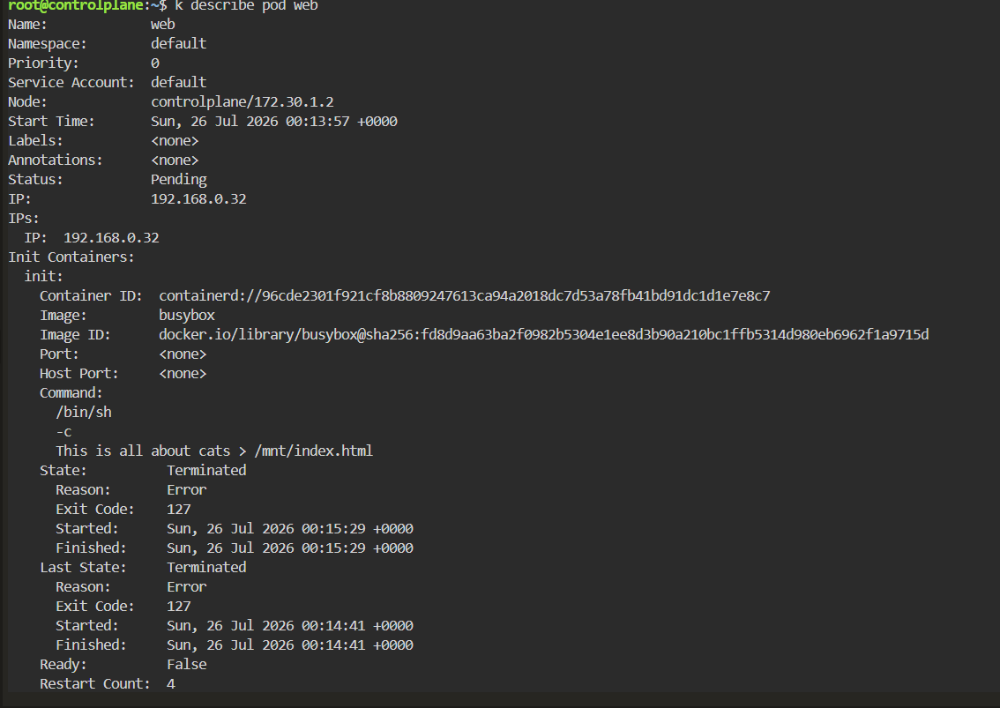
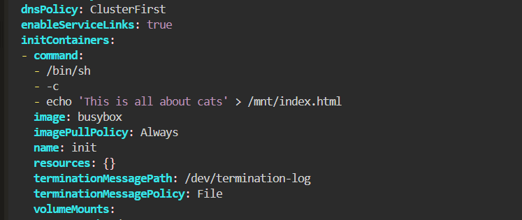
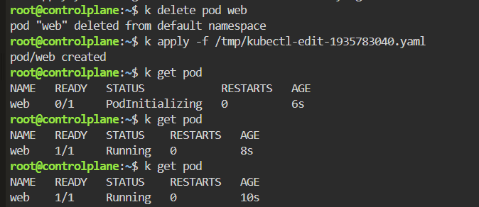

# PodInitializing - Init Container Command Not Found

## Scenario

A Pod remained in the `PodInitializing` state because its init container repeatedly failed.

The init container was responsible for writing an HTML file into a shared `emptyDir` volume before the main container started.

---

## Environment

- Kubernetes
- Killercoda
- kubectl
- BusyBox
- Init Container
- emptyDir Volume

---

## Symptoms

The Pod did not progress to the `Running` state.

```bash
kubectl get pod
```

Result:

```text
NAME   READY   STATUS            RESTARTS   AGE
web    0/1     PodInitializing   0          6s
```

The main application container could not start because the init container had not completed successfully.

---

## Investigation

Inspect the Pod:

```bash
kubectl describe pod web
```

The init container showed:

```text
State:       Terminated
Reason:      Error
Exit Code:   127
Restart Count: 4
```



The Pod events also showed repeated restart attempts:

```text
Back-off restarting failed container init
```



The init container command was:

```yaml
initContainers:
- name: init
  image: busybox
  command:
    - /bin/sh
    - -c
    - This is all about cats > /mnt/index.html
```

---

## Root Cause

The command passed to `/bin/sh -c` was invalid:

```text
This is all about cats > /mnt/index.html
```

The shell attempted to execute `This` as a command.

Because the command did not exist, the shell returned:

```text
Exit Code: 127
```

Exit code `127` usually means:

```text
command not found
```

Since init containers must complete successfully before regular containers can start, the Pod remained in `PodInitializing`.

---

## Initial Attempt

I attempted to modify the existing Pod:

```bash
kubectl edit pod web
```

The modified manifest was saved to a temporary file.

Because init container definitions are not generally editable on an existing Pod, the Pod had to be recreated.

---

## Resolution

Correct the init container command by adding `echo`:

```yaml
initContainers:
- name: init
  image: busybox
  command:
    - /bin/sh
    - -c
    - echo 'This is all about cats' > /mnt/index.html
  volumeMounts:
    - name: shared-pages
      mountPath: /mnt
```



Delete the existing Pod:

```bash
kubectl delete pod web
```

Recreate it using the corrected manifest:

```bash
kubectl apply -f /tmp/kubectl-edit-1935783040.yaml
```

---

## Verification

Immediately after recreation:

```text
web    0/1    PodInitializing
```

A few seconds later:

```bash
kubectl get pod
```

Result:

```text
NAME   READY   STATUS    RESTARTS   AGE
web    1/1     Running   0          8s
```



The init container completed successfully, allowing the main container to start.

---

## Commands Used

```bash
kubectl get pod

kubectl describe pod web

kubectl logs web -c init

kubectl edit pod web

kubectl delete pod web

kubectl apply -f /tmp/kubectl-edit-1935783040.yaml
```

---

## Lessons Learned

- Init containers must finish successfully before application containers can start.
- A Pod may remain in `PodInitializing` when an init container repeatedly fails.
- Exit code `127` usually indicates that a command could not be found.
- Commands passed through `/bin/sh -c` must contain valid shell syntax.
- `kubectl describe pod` reveals init-container state, exit codes, restart counts, and events.
- Use `kubectl logs <pod> -c <init-container>` to inspect init-container logs.
- Shared `emptyDir` volumes can pass generated files from init containers to application containers.
- Changing init container configuration generally requires recreating the Pod.

---

## Key Kubernetes Concepts

- Init Containers
- PodInitializing
- Exit Code 127
- Container Restart Backoff
- emptyDir
- Shared Volumes
- Pod Lifecycle
- Shell Commands