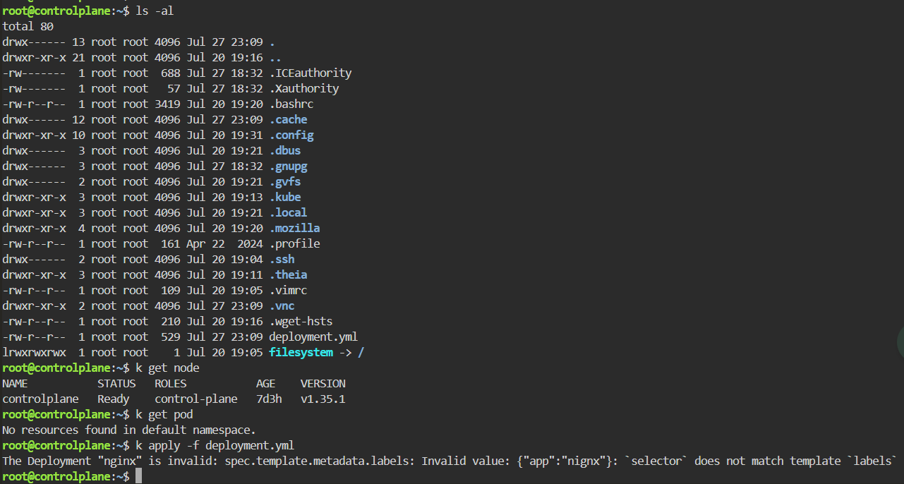
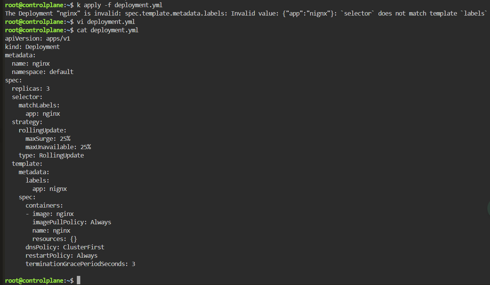
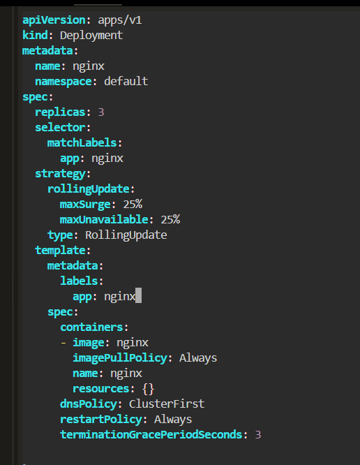
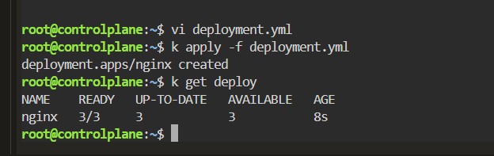

# Deployment Creation - Selector Does Not Match Pod Labels

## Scenario

A Kubernetes Deployment could not be created because the Deployment selector did not match the labels defined in the Pod template.

---

## Environment

- Kubernetes
- Killercoda
- kubectl
- Nginx

---

## Symptoms

Applying the Deployment manifest failed.

```bash
kubectl apply -f deployment.yml
```

Result:

```text
The Deployment "nginx" is invalid:

spec.template.metadata.labels:
Invalid value: {"app":"nginx"}:

`selector` does not match template `labels`
```



No Pods were created:

```bash
kubectl get pod
```

```text
No resources found in default namespace.
```

---

## Investigation

Inspect the Deployment manifest:

```bash
cat deployment.yml
```

The Deployment selector was:

```yaml
selector:
  matchLabels:
    app: nginx
```

However, the Pod template label did not match the selector.

For example:

```yaml
template:
  metadata:
    labels:
      app: nginxx
```

The values must match exactly.



---

## Root Cause

A Deployment uses its selector to identify the Pods that it manages.

The following values were different:

```yaml
spec:
  selector:
    matchLabels:
      app: nginx
```

```yaml
spec:
  template:
    metadata:
      labels:
        app: nginxx
```

Because `nginx` and `nginxx` are different values, Kubernetes rejected the Deployment during API validation.

The Deployment was never created, so the scheduler and kubelet were not involved.

---

## Resolution

Correct the Pod template label so that it exactly matches the Deployment selector.

```yaml
spec:
  selector:
    matchLabels:
      app: nginx

  template:
    metadata:
      labels:
        app: nginx
```



Apply the corrected manifest:

```bash
kubectl apply -f deployment.yml
```

Result:

```text
deployment.apps/nginx created
```

---

## Verification

Check the Deployment:

```bash
kubectl get deploy
```

Result:

```text
NAME    READY   UP-TO-DATE   AVAILABLE   AGE
nginx   3/3     3            3           8s
```



The Deployment successfully created and managed three Nginx Pods.

---

## Commands Used

```bash
kubectl apply -f deployment.yml

kubectl get pod

cat deployment.yml

kubectl get deploy
```

---

## Lessons Learned

- A Deployment selector must match the Pod template labels exactly.
- Kubernetes validates this relationship before creating the Deployment.
- Label keys and values are case-sensitive.
- A selector mismatch is an API validation error, not a scheduler failure.
- No Pods are created when the Deployment manifest is rejected.
- Carefully compare `spec.selector.matchLabels` with `spec.template.metadata.labels`.

---

## Key Kubernetes Concepts

- Deployment
- Labels
- Selectors
- Pod Template
- API Validation
- ReplicaSet
- Declarative Configuration