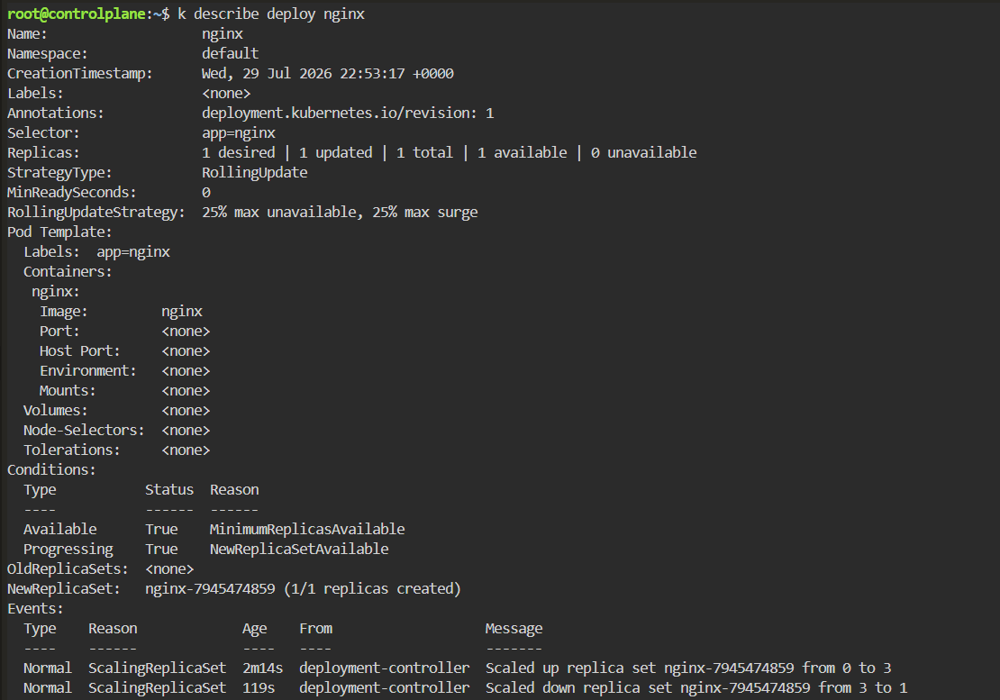
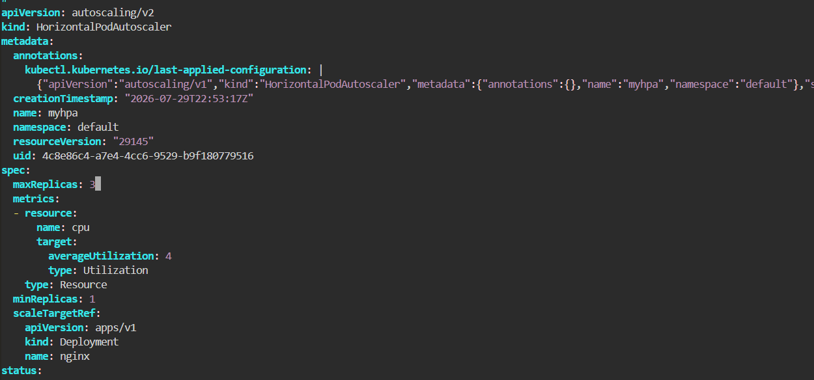
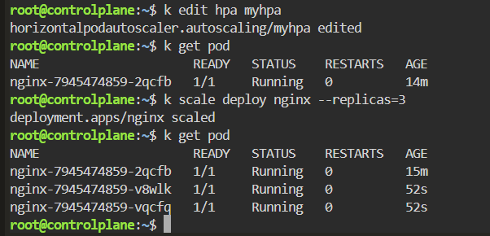

# HPA - Metrics Server Unavailable

## Scenario

A Horizontal Pod Autoscaler (HPA) could not calculate CPU utilization because the Kubernetes Metrics API was unavailable.

Although the target Deployment was healthy, the HPA could not retrieve CPU metrics and therefore could not perform automatic scaling.

---

## Environment

- Kubernetes
- Killercoda
- kubectl
- HorizontalPodAutoscaler (HPA)

---

## Symptoms

Inspect the HPA.

```bash
kubectl describe hpa myhpa
```

The HPA showed:

```text
resource cpu on pods (as a percentage of request):

<unknown> / 4%
```

The conditions reported:

```text
ScalingActive: False
Reason: FailedGetResourceMetric
```



---

## Investigation

The Events section contained the root cause.

```text
failed to get cpu utilization

unable to fetch metrics from resource metrics API

the server could not find the requested resource

(get pods.metrics.k8s.io)
```

This indicates that Kubernetes could not access the Metrics API.

---

## Root Cause

The Horizontal Pod Autoscaler depends on the Kubernetes Metrics API.

Without a working Metrics Server:

- CPU utilization cannot be collected.
- HPA cannot calculate the desired replica count.
- Automatic scaling is disabled.

The Deployment itself was healthy.

---

## Verification

Verify that the Deployment can still scale manually.

```bash
kubectl scale deploy nginx --replicas=3
```

Result

```text
deployment.apps/nginx scaled
```

Check the Pods.

```bash
kubectl get pods
```

Result

```text
3 Pods Running
```



Inspect the Deployment.

```bash
kubectl describe deploy nginx
```

The Deployment controller successfully created three replicas.



This confirms that the Deployment was functioning correctly.

The problem existed only in the HPA metrics pipeline.

---

## Commands Used

```bash
kubectl describe hpa myhpa

kubectl edit hpa myhpa

kubectl scale deploy nginx --replicas=3

kubectl get pods

kubectl describe deploy nginx
```

---

## Lessons Learned

- HPA depends on the Kubernetes Metrics Server.
- `<unknown>` CPU utilization usually indicates missing metrics.
- `kubectl describe hpa` provides detailed HPA status and events.
- Manual Deployment scaling works independently of HPA.
- HPA controls replica count but does not create Pods directly.
- The Metrics API (`metrics.k8s.io`) must be available for CPU-based autoscaling.

---

## Key Kubernetes Concepts

- HorizontalPodAutoscaler
- Metrics Server
- metrics.k8s.io API
- CPU Utilization
- Deployment
- ReplicaSet
- Manual Scaling
- Automatic Scaling