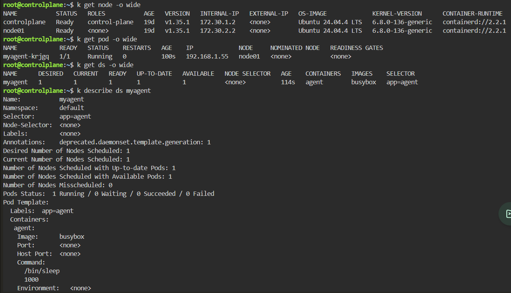
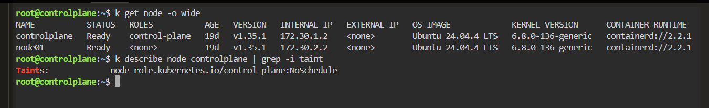
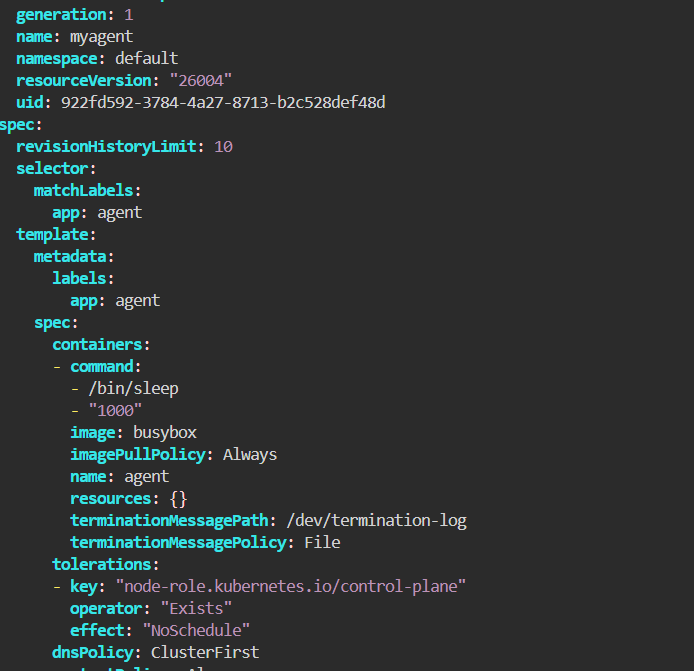
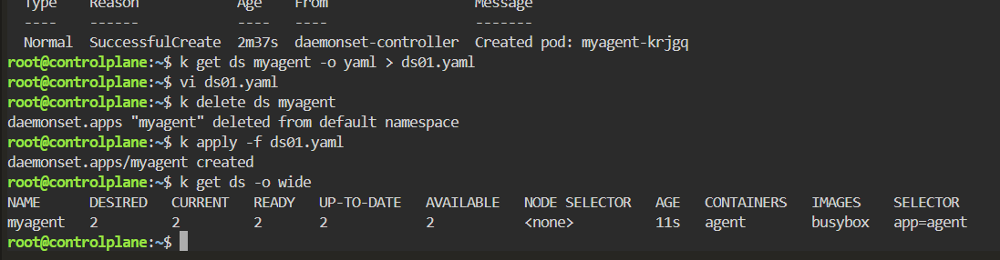

# DaemonSet - Control Plane Taint Prevents Pod Scheduling

## Scenario

A DaemonSet was expected to run one Pod on every node in a two-node Kubernetes cluster.

However, the DaemonSet created only one Pod because the control-plane node had a `NoSchedule` taint that the DaemonSet did not tolerate.

---

## Environment

- Kubernetes
- Killercoda
- kubectl
- DaemonSet
- BusyBox
- Two-node cluster

---

## Symptoms

The cluster contained two nodes:

```bash
kubectl get nodes -o wide
```

```text
NAME           STATUS   ROLES
controlplane   Ready    control-plane
node01         Ready    <none>
```

However, only one DaemonSet Pod was running:

```bash
kubectl get pod -o wide
```

The Pod was scheduled on:

```text
node01
```

Checking the DaemonSet:

```bash
kubectl get ds -o wide
```

showed:

```text
NAME      DESIRED   CURRENT   READY   UP-TO-DATE   AVAILABLE
myagent   1         1         1       1            1
```



---

## Investigation

Since a DaemonSet normally creates a Pod on each eligible node, I inspected the control-plane node for scheduling restrictions.

```bash
kubectl describe node controlplane | grep -i taint
```

Result:

```text
Taints:
node-role.kubernetes.io/control-plane:NoSchedule
```



The control-plane node had a `NoSchedule` taint.

The existing DaemonSet did not contain a matching toleration, so the control-plane node was not eligible for the DaemonSet Pod.

---

## Root Cause

The control-plane node was protected by the following taint:

```text
node-role.kubernetes.io/control-plane:NoSchedule
```

A `NoSchedule` taint prevents Pods without a matching toleration from being scheduled onto the node.

Therefore, although the cluster contained two nodes, only `node01` was eligible for the DaemonSet.

This explains why the DaemonSet reported:

```text
DESIRED: 1
```

instead of:

```text
DESIRED: 2
```

---

## Resolution

Export the existing DaemonSet configuration:

```bash
kubectl get ds myagent -o yaml > ds01.yaml
```

Edit the manifest:

```bash
vi ds01.yaml
```

Add a matching toleration to the Pod template:

```yaml
tolerations:
- key: "node-role.kubernetes.io/control-plane"
  operator: "Exists"
  effect: "NoSchedule"
```



Delete the existing DaemonSet:

```bash
kubectl delete ds myagent
```

Recreate it using the corrected manifest:

```bash
kubectl apply -f ds01.yaml
```

---

## Verification

Check the DaemonSet again:

```bash
kubectl get ds -o wide
```

Result:

```text
NAME      DESIRED   CURRENT   READY   UP-TO-DATE   AVAILABLE
myagent   2         2         2       2            2
```



The DaemonSet could now schedule Pods on both:

```text
controlplane
node01
```

The matching toleration made the control-plane node eligible for the DaemonSet.

---

## Commands Used

```bash
kubectl get nodes -o wide

kubectl get pod -o wide

kubectl get ds -o wide

kubectl describe ds myagent

kubectl describe node controlplane | grep -i taint

kubectl get ds myagent -o yaml > ds01.yaml

vi ds01.yaml

kubectl delete ds myagent

kubectl apply -f ds01.yaml

kubectl get ds -o wide
```

---

## Lessons Learned

- A DaemonSet creates Pods on every eligible node, not necessarily every node in the cluster.
- Control-plane nodes commonly use a `NoSchedule` taint.
- Nodes with untolerated taints are excluded when the DaemonSet controller determines eligible nodes.
- `DESIRED` represents the number of nodes eligible for the DaemonSet.
- A matching toleration can allow DaemonSet Pods to run on tainted nodes.
- `kubectl get pod -o wide` helps identify which nodes are actually running the Pods.
- `kubectl describe node` is useful when a DaemonSet unexpectedly skips a node.

---

## Key Kubernetes Concepts

- DaemonSet
- Taints
- Tolerations
- NoSchedule
- Control Plane Nodes
- Pod Scheduling
- DaemonSet Controller
- Node Eligibility