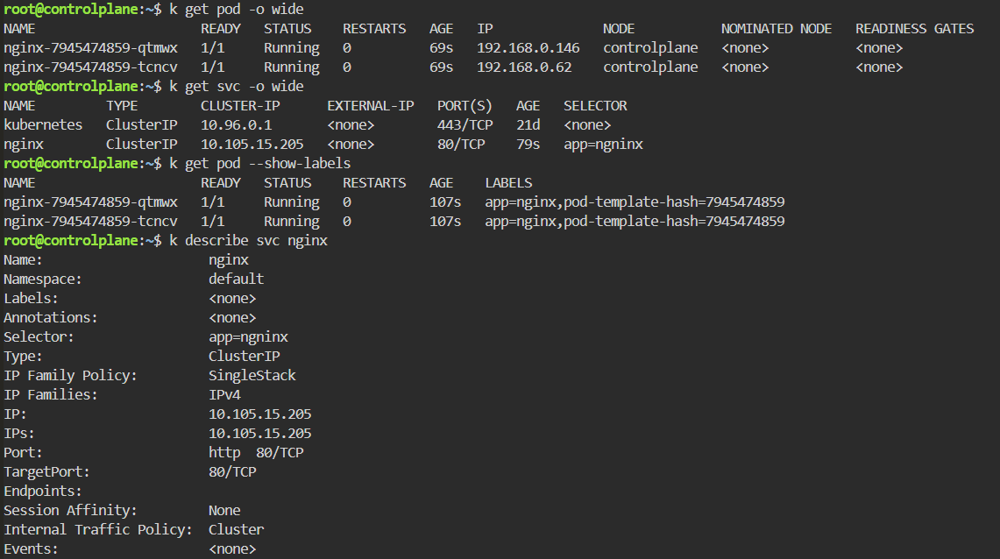
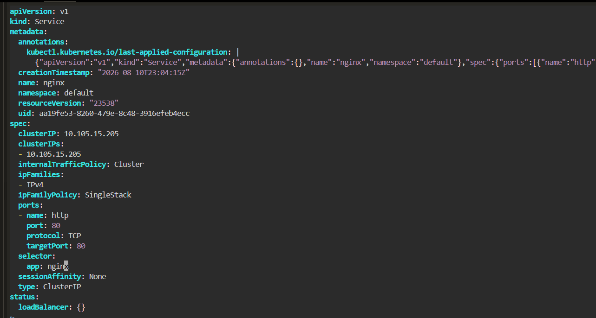
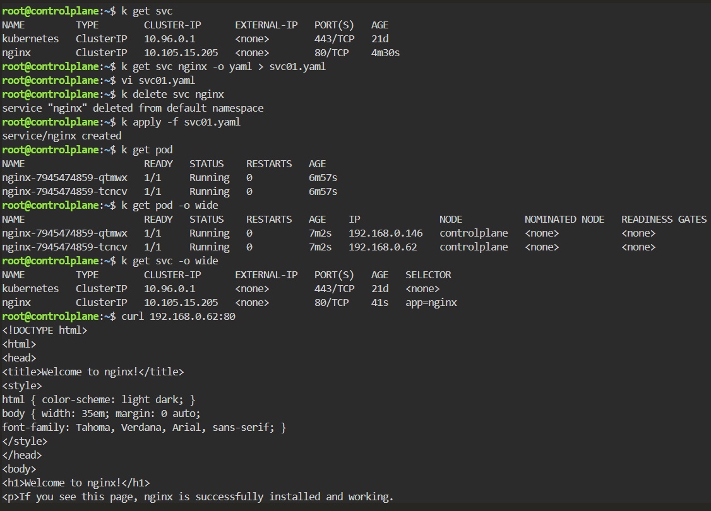

# Service Connectivity - Selector and Endpoint Verification

## Scenario

An nginx Service needed to be verified to ensure that it correctly routed traffic to the backend Pods.

---

## Environment

- Kubernetes
- Killercoda
- kubectl
- nginx

---

## Investigation

Checked the running Pods and their IP addresses.

```bash
kubectl get pod -o wide
```

Then checked the Service.

```bash
kubectl get svc -o wide
```

The nginx Service was configured as a ClusterIP Service:

```text
NAME    TYPE        CLUSTER-IP      PORT(S)   SELECTOR
nginx   ClusterIP   10.105.15.205   80/TCP    app=nginx
```

---

## Selector Verification

Checked the labels assigned to the nginx Pods.

```bash
kubectl get pod --show-labels
```

Result:

```text
NAME                     READY   STATUS    LABELS
nginx-7945474859-qtmwx    1/1     Running   app=nginx,pod-template-hash=7945474859
nginx-7945474859-tcncv    1/1     Running   app=nginx,pod-template-hash=7945474859
```

The Service selector was:

```text
app=nginx
```

The Service selector therefore correctly matched the Pod labels.



---

## Endpoint Verification

Checked the Service configuration.

```bash
kubectl describe svc nginx
```

The Service discovered the nginx Pods as endpoints:

```text
Endpoints: 192.168.0.146:80, 192.168.0.62:80
```

This confirmed that Kubernetes successfully associated the Service with the backend Pods.



---

## Connectivity Test

Tested the ClusterIP directly.

```bash
curl 10.105.15.205:80
```

The nginx HTML page was returned successfully.

```text
<title>Welcome to nginx!</title>
```

This confirmed that traffic could reach the nginx Pods through the Kubernetes Service.



---

## Verification

The complete traffic path was verified:

```text
Client
  |
  v
ClusterIP Service
10.105.15.205:80
  |
  | selector: app=nginx
  v
Endpoints
  |
  +-- 192.168.0.146:80
  |
  +-- 192.168.0.62:80
  |
  v
nginx Pods
```

The Service successfully selected the Pods and forwarded traffic to the backend containers.

---

## Commands Used

```bash
kubectl get svc

kubectl get svc -o wide

kubectl get pod -o wide

kubectl get pod --show-labels

kubectl describe svc nginx

curl 10.105.15.205:80
```

---

## Lessons Learned

- Kubernetes Services route traffic to Pods through label selectors.
- Service selectors must match the labels assigned to the target Pods.
- Running Pods do not necessarily mean that a Service can reach them.
- `kubectl get pod --show-labels` helps verify selector-to-Pod relationships.
- `kubectl describe svc` shows whether the Service has discovered backend endpoints.
- Empty endpoints often indicate a selector mismatch or Pod readiness problem.
- `curl` can be used to verify end-to-end Service connectivity.
- Troubleshooting should follow the traffic path from Service to selector, endpoints, and finally Pods.