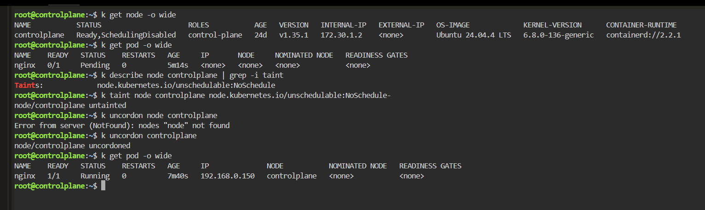

# Pending Pod - Cordoned Node

## Scenario

An nginx Pod remained in the `Pending` state because the only available Kubernetes node had been marked as unschedulable.

The objective was to identify why the scheduler could not place the Pod and restore normal scheduling.

---

## Environment

* Kubernetes
* Killercoda
* kubectl
* nginx

---

## Symptoms

The nginx Pod remained in the `Pending` state and had not been assigned to any node.

```bash
kubectl get pod -o wide
```

Result:

```text
NAME    READY   STATUS    RESTARTS   AGE     IP       NODE
nginx   0/1     Pending   0          5m14s   <none>   <none>
```

The absence of a node assignment indicated a scheduling problem.

---

## Investigation

Checked the status of the Kubernetes node.

```bash
kubectl get node -o wide
```

Result:

```text
NAME           STATUS                     ROLES           VERSION
controlplane   Ready,SchedulingDisabled   control-plane   v1.35.1
```

Although the node itself was `Ready`, it was also marked:

```text
SchedulingDisabled
```

This indicated that the node was cordoned and unavailable for scheduling new Pods.

I also inspected its taints:

```bash
kubectl describe node controlplane | grep -i taint
```

Result:

```text
Taints:
node.kubernetes.io/unschedulable:NoSchedule
```

---

## Root Cause

The `controlplane` node had been cordoned.

A cordoned node can continue running existing workloads, but Kubernetes will not normally schedule new Pods onto it.

The node therefore appeared as:

```text
Ready,SchedulingDisabled
```

and the nginx Pod remained:

```text
Pending
```

with no node assigned.

---

## Initial Attempt

I initially removed the `unschedulable` taint manually:

```bash
kubectl taint node controlplane node.kubernetes.io/unschedulable:NoSchedule-
```

Result:

```text
node/controlplane untainted
```

However, removing the taint directly was not the proper way to restore a node that had been cordoned.

The node's scheduling state should instead be managed with `kubectl cordon` and `kubectl uncordon`.

---

## Resolution

The node was restored to a schedulable state using:

```bash
kubectl uncordon controlplane
```

Result:

```text
node/controlplane uncordoned
```

This allowed the Kubernetes scheduler to assign the pending nginx Pod to the node.

---

## Verification

Checked the Pod again:

```bash
kubectl get pod -o wide
```

Result:

```text
NAME    READY   STATUS    RESTARTS   IP              NODE
nginx   1/1     Running   0          192.168.0.150   controlplane
```

The Pod changed from:

```text
Pending
```

to:

```text
Running
```

and was successfully assigned to:

```text
controlplane
```

This confirmed that the node's unschedulable state had caused the scheduling failure.



---

## Troubleshooting Flow

```text
Pod Pending
    |
    v
kubectl get pod -o wide
    |
    v
NODE = <none>
    |
    v
kubectl get node
    |
    v
Ready,SchedulingDisabled
    |
    v
Node is cordoned
    |
    v
kubectl uncordon controlplane
    |
    v
Scheduler assigns Pod
    |
    v
Pod Running
```

---

## Commands Used

```bash
kubectl get node -o wide

kubectl get pod -o wide

kubectl describe node controlplane | grep -i taint

kubectl taint node controlplane node.kubernetes.io/unschedulable:NoSchedule-

kubectl uncordon controlplane

kubectl get pod -o wide
```

---

## Lessons Learned

* `Pending` Pods often indicate a scheduling problem.
* A node can be `Ready` while still being unavailable for new workloads.
* `Ready,SchedulingDisabled` indicates that the node has been cordoned.
* `kubectl cordon` prevents new Pods from being scheduled onto a node.
* Existing workloads are not automatically removed when a node is cordoned.
* `kubectl uncordon` restores the node to a schedulable state.
* Checking the `NODE` column with `kubectl get pod -o wide` quickly reveals whether a Pod has been scheduled.
* Node status should be checked early when investigating unexplained `Pending` Pods.
* Kubernetes scheduling problems should be diagnosed from the scheduler and node state rather than assuming the container itself is faulty.
