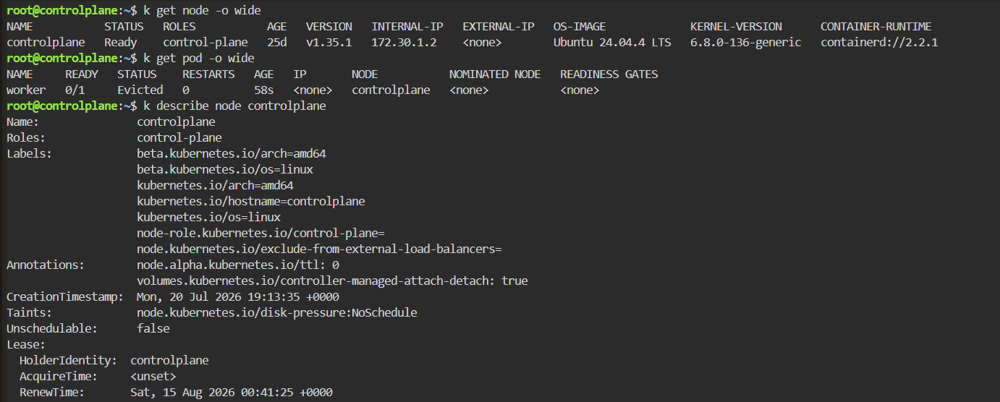
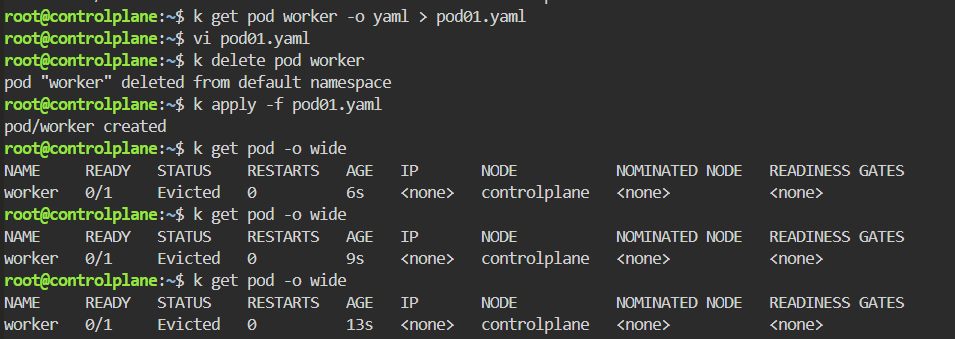
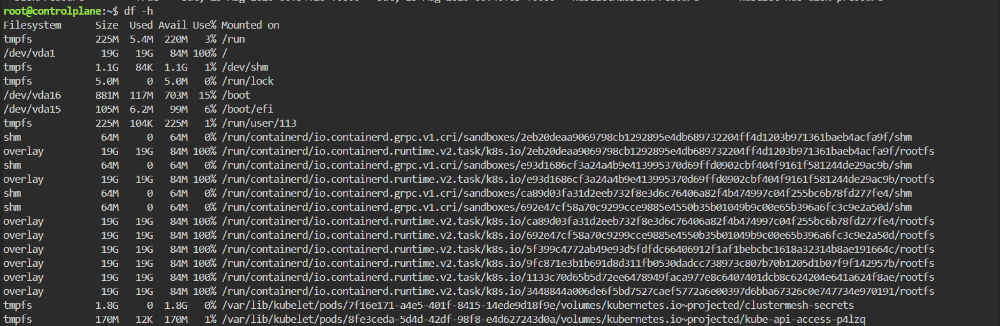
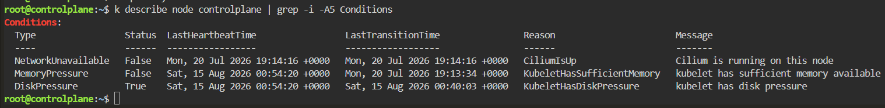
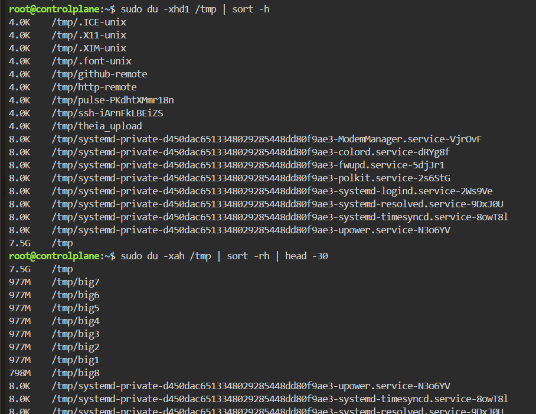
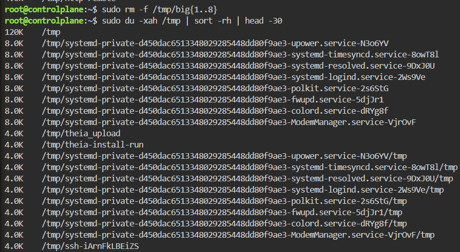
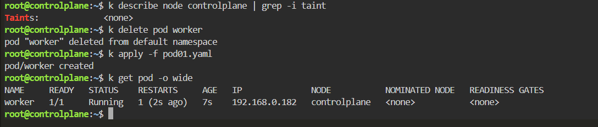

# Node DiskPressure - Pod Eviction

## Scenario

A Kubernetes Pod was evicted because the node entered a `DiskPressure` condition.

The node filesystem had reached 100% utilization, causing kubelet to detect insufficient disk space and apply the `node.kubernetes.io/disk-pressure:NoSchedule` taint.

---

## Environment

- Kubernetes
- Killercoda
- kubectl
- Linux
- containerd

---

## Symptoms

The Pod was unexpectedly evicted.

```bash
kubectl get pod -o wide
```

Result:

```text
NAME     READY   STATUS    RESTARTS   AGE
worker   0/1     Evicted   0          58s
```

The node itself was still `Ready`.

```bash
kubectl get node -o wide
```

---

## Investigation

### 1. Inspect the Node

```bash
kubectl describe node controlplane
```

The node showed the following taint:

```text
Taints:
node.kubernetes.io/disk-pressure:NoSchedule
```

This indicated that kubelet had detected disk pressure and Kubernetes was preventing normal Pods from being scheduled onto the node.



---

### 2. Check Node Conditions

```bash
kubectl describe node controlplane | grep -i -A5 Conditions
```

Result:

```text
DiskPressure   True
```

with:

```text
Reason: KubeletHasDiskPressure
Message: kubelet has disk pressure
```



---

### 3. Inspect Pod Events

```bash
kubectl describe pod worker
```

The Events section revealed the direct cause:

```text
Warning  Evicted  kubelet  The node had condition: [DiskPressure].
```



This confirmed that the problem was not an application failure.

The Pod was evicted by kubelet because of node resource pressure.

---

### 4. Check Filesystem Usage

```bash
df -h
```

The root filesystem was completely full:

```text
Filesystem   Size   Used   Avail   Use%   Mounted on
/dev/vda1     19G    19G     84M   100%   /
```



This explained the `DiskPressure=True` node condition.

---

### 5. Find Large Directories

I investigated disk usage from the root filesystem:

```bash
sudo du -xhd1 / | sort -h
```

The result showed:

```text
7.5G    /tmp
5.5G    /usr
3.4G    /var
```

`/tmp` was unusually large.

I then inspected it:

```bash
sudo du -xhd1 /tmp | sort -h
```

and:

```bash
sudo du -xah /tmp | sort -rh | head -30
```

The investigation revealed several large temporary files:

```text
977M    /tmp/big1
977M    /tmp/big2
977M    /tmp/big3
977M    /tmp/big4
977M    /tmp/big5
977M    /tmp/big6
977M    /tmp/big7
798M    /tmp/big8
```

Together they consumed roughly 7.5 GB.



---

## Root Cause

The root filesystem had reached 100% utilization because several large files had been created under `/tmp`.

```text
/tmp/big1
/tmp/big2
/tmp/big3
/tmp/big4
/tmp/big5
/tmp/big6
/tmp/big7
/tmp/big8
```

This caused kubelet to detect:

```text
DiskPressure=True
```

Kubernetes then applied:

```text
node.kubernetes.io/disk-pressure:NoSchedule
```

and the worker Pod was evicted.

The failure chain was:

```text
Large files in /tmp
        ↓
Root filesystem reaches 100%
        ↓
Kubelet detects disk pressure
        ↓
DiskPressure=True
        ↓
disk-pressure:NoSchedule taint
        ↓
Pod eviction / scheduling restrictions
```

---

## Resolution

The large temporary files were removed:

```bash
sudo rm -f /tmp/big{1..8}
```

Disk usage was checked again:

```bash
sudo du -xah /tmp | sort -rh | head -30
```

After cleanup, `/tmp` had dropped to approximately:

```text
120K    /tmp
```



---

## Verification

After sufficient disk space became available, the node recovered from DiskPressure.

```bash
kubectl describe node controlplane | grep -i taint
```

Result:

```text
Taints: <none>
```

The Pod was recreated:

```bash
kubectl delete pod worker
kubectl apply -f pod01.yaml
```

Then:

```bash
kubectl get pod -o wide
```

Result:

```text
NAME     READY   STATUS    RESTARTS   AGE
worker   1/1     Running   1          7s
```



The absence of the `disk-pressure` taint and the successful Pod startup confirmed that the node had recovered.

---

## Commands Used

```bash
kubectl get node -o wide

kubectl get pod -o wide

kubectl describe node controlplane

kubectl describe node controlplane | grep -i taint

kubectl describe node controlplane | grep -i -A5 Conditions

kubectl describe pod worker

df -h

sudo du -xhd1 / | sort -h

sudo du -xhd1 /tmp | sort -h

sudo du -xah /tmp | sort -rh | head -30

sudo rm -f /tmp/big{1..8}

kubectl delete pod worker

kubectl apply -f pod01.yaml

kubectl get pod -o wide
```

---

## Lessons Learned

- A `Ready` node can still suffer from resource-pressure conditions such as `DiskPressure`.
- `kubectl describe node` is essential for diagnosing node-level Kubernetes problems.
- Always inspect both **Conditions** and **Taints** when troubleshooting scheduling or eviction issues.
- `DiskPressure=True` indicates that kubelet considers available disk resources critically low.
- Kubernetes can evict Pods to protect node stability when disk resources become constrained.
- The `node.kubernetes.io/disk-pressure:NoSchedule` taint prevents additional normal workloads from being scheduled onto the affected node.
- `df -h` identifies filesystem capacity problems, while `du` helps locate the directories and files consuming that capacity.
- Kubernetes troubleshooting often requires moving below the Kubernetes abstraction and investigating the underlying Linux host.
- Removing the symptom at the Kubernetes level is not enough. The underlying node resource problem must be fixed.

---

## Troubleshooting Pattern

```text
Pod Evicted
    ↓
kubectl describe pod
    ↓
"node had condition: DiskPressure"
    ↓
kubectl describe node
    ↓
DiskPressure=True
    ↓
Check node taints
    ↓
disk-pressure:NoSchedule
    ↓
df -h
    ↓
Root filesystem 100%
    ↓
du -xhd1 /
    ↓
Large /tmp usage
    ↓
du -xah /tmp
    ↓
Identify large files
    ↓
Remove unnecessary files
    ↓
DiskPressure clears
    ↓
Recreate workload
    ↓
Pod Running
```