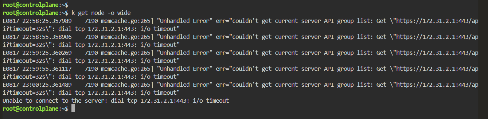
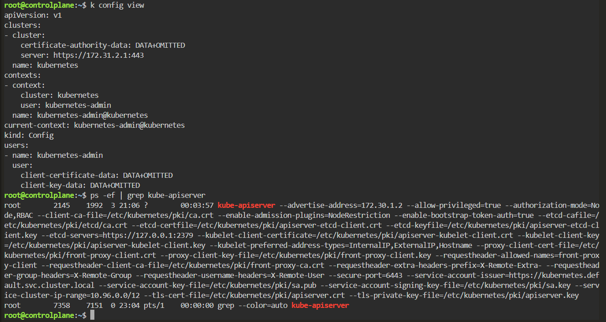
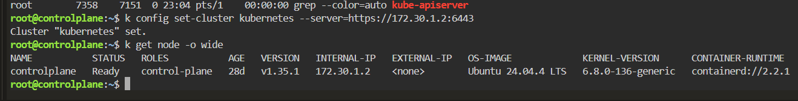
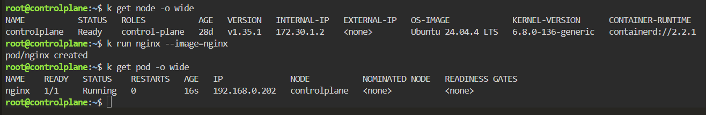

# Kubeconfig Wrong API Server - kubectl Connection Timeout

## Scenario

`kubectl` commands suddenly failed because the kubeconfig contained an incorrect Kubernetes API server address.

The Kubernetes control plane itself was running, but `kubectl` was attempting to connect to the wrong IP address and port.

---

## Environment

- Kubernetes
- Killercoda
- kubectl
- kube-apiserver
- Linux

---

## Symptoms

Running:

```bash
kubectl get node -o wide
```

failed repeatedly with:

```text
couldn't get current server API group list
```

and:

```text
dial tcp 172.31.2.1:443: i/o timeout
```

Eventually kubectl returned:

```text
Unable to connect to the server: dial tcp 172.31.2.1:443: i/o timeout
```



---

## Investigation

### 1. Inspect the Current Kubeconfig

I checked the configuration used by kubectl:

```bash
kubectl config view
```

The cluster configuration contained:

```yaml
clusters:
- cluster:
    server: https://172.31.2.1:443
  name: kubernetes
```

This showed that kubectl was attempting to contact:

```text
172.31.2.1:443
```



---

### 2. Verify the kube-apiserver Process

Because kubectl could not communicate with the API server, I inspected the control-plane process directly from the Linux host:

```bash
ps -ef | grep kube-apiserver
```

The running process showed:

```text
--advertise-address=172.30.1.2
```

and:

```text
--secure-port=6443
```

This revealed that the Kubernetes API server was actually using:

```text
https://172.30.1.2:6443
```

The kubeconfig therefore contained the wrong API endpoint.



---

## Root Cause

The kubeconfig pointed kubectl to an incorrect API server endpoint:

```text
https://172.31.2.1:443
```

while the actual kube-apiserver was running with:

```text
IP:   172.30.1.2
Port: 6443
```

The failure chain was:

```text
kubectl command
      ↓
Read kubeconfig
      ↓
server: https://172.31.2.1:443
      ↓
Attempt TCP connection
      ↓
Connection timeout
      ↓
kubectl cannot reach Kubernetes API
```

The Kubernetes cluster itself was not necessarily down.

The client configuration was pointing to the wrong control-plane endpoint.

---

## Resolution

I corrected the API server endpoint in the kubeconfig:

```bash
kubectl config set-cluster kubernetes \
  --server=https://172.30.1.2:6443
```

Result:

```text
Cluster "kubernetes" set.
```



---

## Verification

I tested communication with the Kubernetes API again:

```bash
kubectl get node -o wide
```

Result:

```text
NAME           STATUS   ROLES           VERSION   INTERNAL-IP
controlplane   Ready    control-plane   v1.35.1   172.30.1.2
```

The command now completed successfully.

I also created a test Pod:

```bash
kubectl run nginx --image=nginx
```

Result:

```text
pod/nginx created
```

Then:

```bash
kubectl get pod -o wide
```

returned:

```text
NAME    READY   STATUS    RESTARTS   AGE
nginx   1/1     Running   0          16s
```

This confirmed that kubectl could communicate with the API server and Kubernetes was functioning normally.

---

## Commands Used

```bash
kubectl get node -o wide

kubectl config view

ps -ef | grep kube-apiserver

kubectl config set-cluster kubernetes \
  --server=https://172.30.1.2:6443

kubectl get node -o wide

kubectl run nginx --image=nginx

kubectl get pod -o wide
```

---

## Lessons Learned

- `kubectl` depends on kubeconfig to locate the Kubernetes API server.
- A kubectl connection failure does not automatically mean the Kubernetes control plane is down.
- Always inspect the endpoint shown in `kubectl config view`.
- `i/o timeout` points toward a connectivity or endpoint problem rather than a Kubernetes object-level error.
- When kubectl itself is unavailable, Linux-level investigation can still be used to inspect control-plane processes.
- `ps -ef | grep kube-apiserver` can reveal the API server's configured address and secure port on a control-plane node.
- Kubernetes commonly exposes the kube-apiserver secure endpoint on port `6443`.
- Troubleshooting should distinguish between a server failure and a client configuration failure.

---

## Troubleshooting Pattern

```text
kubectl command fails
        ↓
Read error message
        ↓
dial tcp <IP>:<PORT>: i/o timeout
        ↓
kubectl config view
        ↓
Identify configured API endpoint
        ↓
Inspect kube-apiserver locally
        ↓
Compare actual IP/port
        ↓
Correct kubeconfig
        ↓
kubectl get nodes
        ↓
Cluster access restored
```