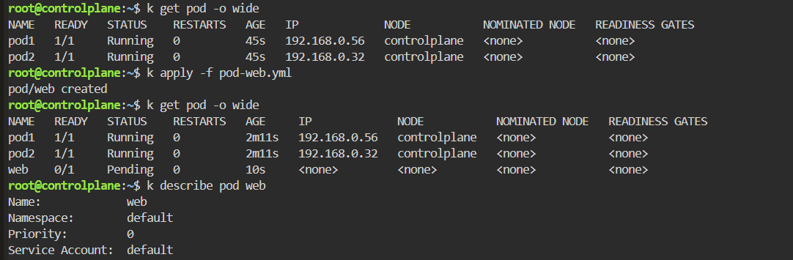
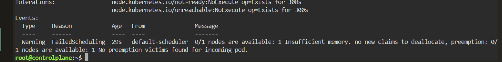
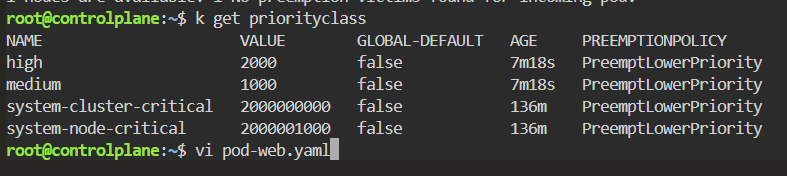
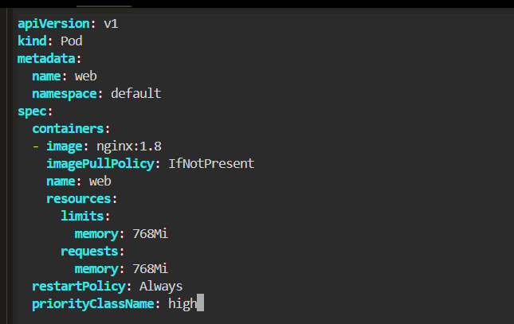
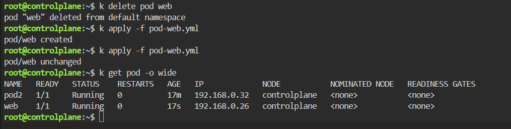

# Pod Priority and Preemption - Insufficient Memory

## Scenario

A Pod remained in the `Pending` state because the Kubernetes scheduler could not find enough available memory on the node.

The cluster already contained running Pods consuming the available resources.

A higher-priority `PriorityClass` was assigned to the new Pod, allowing Kubernetes preemption to remove a lower-priority Pod and schedule the higher-priority workload.

---

## Environment

- Kubernetes
- Killercoda
- kubectl
- PriorityClass
- Kubernetes Scheduler

---

## Symptoms

Two Pods were already running on the node:

```bash
kubectl get pod -o wide
```

Result:

```text
NAME   READY   STATUS    RESTARTS   AGE
pod1   1/1     Running   0          45s
pod2   1/1     Running   0          45s
```

A new Pod was then created:

```bash
kubectl apply -f pod-web.yml
```

Result:

```text
pod/web created
```

However, the new Pod remained `Pending`:

```text
NAME   READY   STATUS    RESTARTS
pod1   1/1     Running   0
pod2   1/1     Running   0
web    0/1     Pending   0
```



---

## Investigation

### 1. Inspect the Pending Pod

```bash
kubectl describe pod web
```

The Events section showed:

```text
Warning  FailedScheduling  default-scheduler
0/1 nodes are available: 1 Insufficient memory.
```

The scheduler also reported:

```text
No preemption victims found for incoming pod.
```



This showed that the Pod could not be scheduled because the node did not have enough available memory.

---

### 2. Inspect Available PriorityClasses

I checked the PriorityClasses configured in the cluster:

```bash
kubectl get priorityclass
```

Result:

```text
NAME                     VALUE
high                     2000
medium                   1000
system-cluster-critical  2000000000
system-node-critical     2000001000
```



A Pod with a higher priority value is considered more important by the Kubernetes scheduler than a Pod with a lower priority.

---

## Pod Configuration

The `web` Pod requested `768Mi` of memory:

```yaml
apiVersion: v1
kind: Pod
metadata:
  name: web
  namespace: default

spec:
  containers:
    - image: nginx:1.8
      imagePullPolicy: IfNotPresent
      name: web

      resources:
        limits:
          memory: 768Mi

        requests:
          memory: 768Mi

  restartPolicy: Always
  priorityClassName: high
```

The important setting was:

```yaml
priorityClassName: high
```

The `high` PriorityClass had a value of:

```text
2000
```



---

## Root Cause

The node did not have enough free memory to satisfy the new Pod's request:

```yaml
requests:
  memory: 768Mi
```

The scheduler therefore initially kept the Pod in:

```text
Pending
```

with:

```text
Insufficient memory
```

The scheduling problem can be represented as:

```text
Existing Pods consume node memory
            ↓
web requests 768Mi
            ↓
Scheduler evaluates node
            ↓
Insufficient memory
            ↓
Pod remains Pending
```

---

## Resolution

The `web` Pod was assigned the higher-priority class:

```yaml
priorityClassName: high
```

The Pod was then recreated:

```bash
kubectl delete pod web
kubectl apply -f pod-web.yml
```

Kubernetes could now use priority and preemption when deciding how to schedule the workload.

---

## Preemption

When a higher-priority Pod cannot be scheduled because of insufficient resources, Kubernetes can identify lower-priority Pods as potential preemption victims.

Those lower-priority Pods may be terminated so that sufficient resources become available for the higher-priority Pod.

Conceptually:

```text
Node memory exhausted
        ↓
High-priority Pod arrives
        ↓
Scheduler cannot place Pod
        ↓
Evaluate lower-priority Pods
        ↓
Preempt suitable victim
        ↓
Memory becomes available
        ↓
High-priority Pod scheduled
```

---

## Verification

After recreating the Pod:

```bash
kubectl get pod -o wide
```

Result:

```text
NAME   READY   STATUS    RESTARTS   AGE
pod2   1/1     Running   0          17m
web    1/1     Running   0          17s
```

The `web` Pod successfully obtained an IP address and was scheduled onto:

```text
controlplane
```



The higher-priority workload was now running while one of the previously running workloads was no longer present.

---

## Commands Used

```bash
kubectl get node -o wide

kubectl get pod -o wide

kubectl apply -f pod-web.yml

kubectl describe pod web

kubectl get priorityclass

kubectl delete pod web

kubectl apply -f pod-web.yml

kubectl get pod -o wide
```

---

## Lessons Learned

- Kubernetes schedules Pods according to their resource `requests`, not merely their current memory consumption.
- A Pod remains `Pending` when no node can satisfy its resource requests.
- `kubectl describe pod` and the Events section should be checked first for scheduling failures.
- `Insufficient memory` means the scheduler cannot find enough allocatable memory for the Pod request.
- `PriorityClass` assigns relative importance to workloads.
- A larger PriorityClass value represents a higher scheduling priority.
- Higher-priority Pods can trigger preemption of lower-priority Pods when cluster resources are insufficient.
- Priority does not create additional resources; it determines which workloads should receive scarce resources first.
- Preemption should be treated carefully in production because solving one scheduling problem can terminate another workload.

---

## Troubleshooting Pattern

```text
Pod Pending
    ↓
kubectl describe pod
    ↓
FailedScheduling
    ↓
Insufficient memory
    ↓
Check Pod resource requests
    ↓
Check PriorityClasses
    ↓
Assign appropriate PriorityClass
    ↓
Scheduler evaluates preemption
    ↓
Lower-priority Pod removed
    ↓
Resources become available
    ↓
Higher-priority Pod Running
```

---

## Key Concept

```text
Priority != More Resources

Priority = Who gets scarce resources first
```

A PriorityClass does not increase node CPU or memory.

It tells the Kubernetes scheduler which workload should take precedence when multiple workloads compete for limited cluster resources.