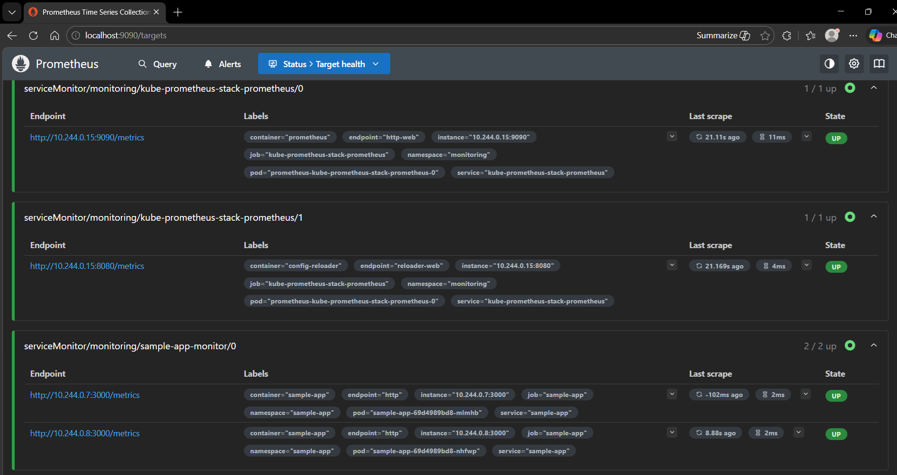
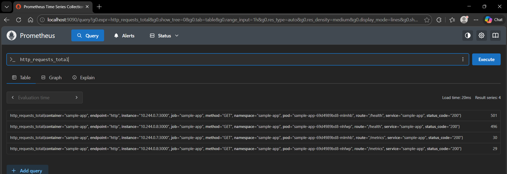
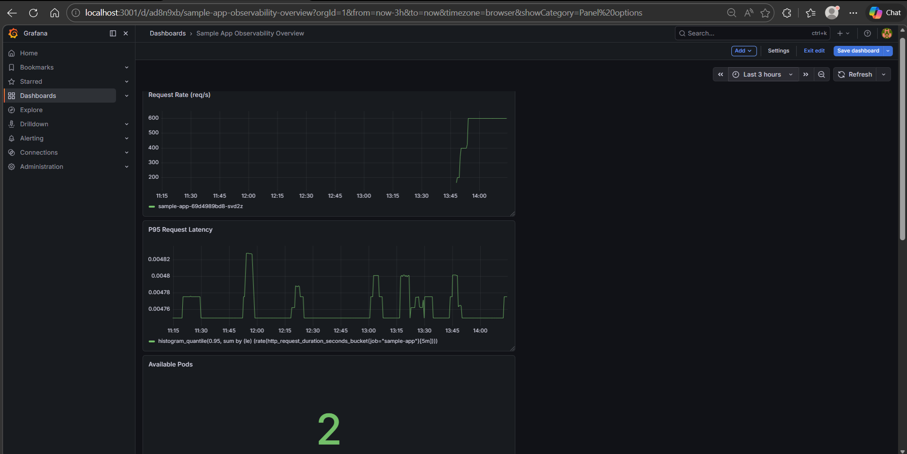
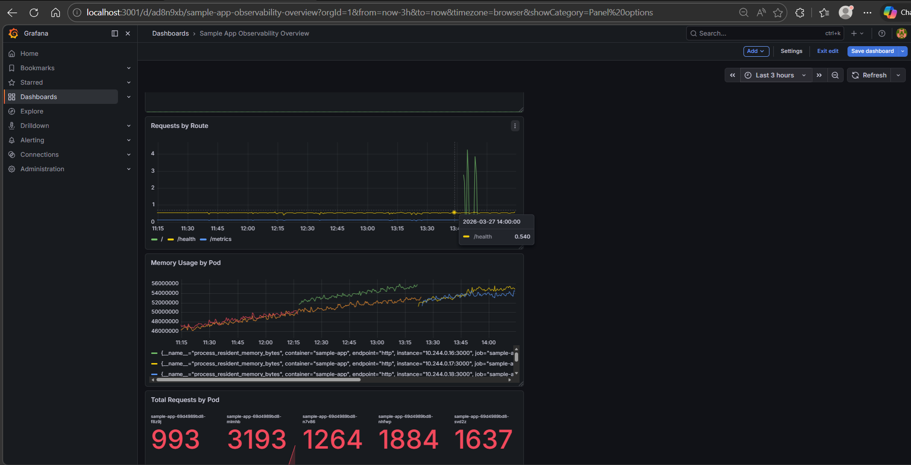
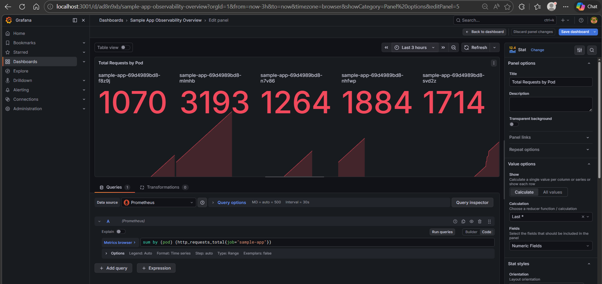
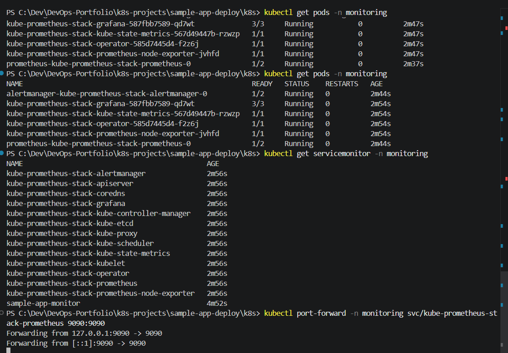

# Kubernetes Observability Case Study

Built an end-to-end observability workflow for a Kubernetes-hosted Node.js service, using Prometheus for metric collection, Grafana for visualization, and a live pod-failure drill to validate self-healing and service visibility.

## Overview

This project extends a simple Node.js application into an observable Kubernetes workload.

The goal was not just to deploy an app, but to make its behavior visible:
- traffic
- route-level request patterns
- latency
- pod availability
- pod-level memory usage
- request distribution across replicas

I deployed the app to a local `kind` cluster, exposed Prometheus metrics from the application itself, installed the monitoring stack with Helm, and visualized the resulting signals in Grafana.

I then simulated a pod failure to verify that:
- Kubernetes replaced the failed pod
- Prometheus continued scraping healthy targets
- Grafana reflected the temporary reduction in available pods

## Stack

- Windows 11
- Docker Desktop
- kind
- Kubernetes
- Node.js
- Prometheus
- Grafana
- Helm
- kube-prometheus-stack

## Project Structure

```text
observability/
├── app/
│   ├── Dockerfile
│   ├── package.json
│   ├── package-lock.json
│   └── server.js
├── images/
│   ├── grafana-dashboard-overview-bottom.png
│   ├── grafana-dashboard-overview-top.png
│   ├── grafana-pod-availability-during-incident.png
│   ├── kubernetes-monitoring-stack-status.png
│   ├── prometheus-latency-or-memory-query.png
│   ├── prometheus-query-app-metrics.png
│   └── prometheus-target-health-sample-app.png
├── k8s/
│   ├── deployment.yaml
│   ├── namespace.yaml
│   ├── service.yaml
│   └── servicemonitor.yaml
└── README.md
```

## Architecture

The observability flow is:

1. Node.js app exposes:
   - `/`
   - `/health`
   - `/metrics`

2. Kubernetes runs the app as a Deployment with multiple replicas.

3. A ClusterIP Service exposes the app inside the cluster.

4. A `ServiceMonitor` tells Prometheus how to discover and scrape the app's metrics endpoint.

5. Prometheus collects:
   - custom app request metrics
   - app latency histogram metrics
   - default process metrics

6. Grafana visualizes those metrics in dashboard panels.

## Application Instrumentation

I added Prometheus instrumentation to the Node.js app using `prom-client`.

### Metrics exposed
- `http_requests_total`
- `http_request_duration_seconds`
- default Node.js process metrics such as:
  - CPU usage
  - memory usage

### Added endpoints
- `/` for application traffic
- `/health` for liveness/readiness probes
- `/metrics` for Prometheus scraping

This turned a basic sample app into an observable workload.

## Kubernetes Setup

The workload is deployed with:
- `namespace.yaml`
- `deployment.yaml`
- `service.yaml`
- `servicemonitor.yaml`

### Deployment
- 2 replicas
- container port `3000`
- liveness probe on `/health`
- readiness probe on `/health`

### Service
- `ClusterIP`
- named port `http`
- selected by label `app: sample-app`

### ServiceMonitor
Used to integrate the app with `kube-prometheus-stack` in a clean Kubernetes-native way.

## Monitoring Stack

I installed the monitoring stack with Helm using `kube-prometheus-stack`.

Core components:
- Prometheus
- Grafana
- Prometheus Operator
- kube-state-metrics
- node-exporter

This enabled both:
- cluster-level observability
- application-level observability

## Grafana Dashboard

I built a custom dashboard called:

**Sample App Observability Overview**

### Dashboard panels
- Request Rate (req/s)
- Requests by Route
- P95 Request Latency
- Memory Usage by Pod
- Total Requests by Pod
- Available Pods

These panels let me observe:
- incoming traffic volume
- route distribution
- latency behavior
- memory growth by pod
- request spread across replicas
- pod health during disruption

## Incident Simulation

To validate the setup, I intentionally deleted a running application pod.

### What I expected
- one replica would disappear temporarily
- Kubernetes would recreate it
- Prometheus would continue scraping healthy targets
- Grafana would reflect the reduction in available pods

### What happened
- the available pod count dropped during the failure window
- a replacement pod was created automatically
- the system recovered back to healthy state

This demonstrated Kubernetes self-healing with live observability.

## Key Outcomes

- Successfully instrumented a Node.js app for Prometheus
- Deployed the app to Kubernetes with health probes
- Installed Prometheus and Grafana using Helm
- Verified target discovery through `ServiceMonitor`
- Built Grafana dashboards for app-level visibility
- Simulated pod failure and observed recovery in live metrics

## Screenshots

### Prometheus target health
Prometheus successfully discovered and scraped both application replicas.



### Prometheus query result
Application metrics were available for direct querying.



### Grafana dashboard overview
Top half of the observability dashboard.



Bottom half of the observability dashboard.



### Pod disruption signal
The dashboard reflected a temporary availability drop during pod deletion.



### Monitoring stack status
Monitoring components were deployed and running in Kubernetes.



## What I Learned

- Instrumentation is what makes dashboards meaningful
- `ServiceMonitor` is a cleaner solution than ad hoc scrape configuration
- Even a very small app can demonstrate real observability concepts
- Pod failure becomes far easier to understand when metrics and dashboards are already in place
- Kubernetes self-healing is more convincing when paired with live operational evidence

## Next Improvements

- Add a cleaner recovery-state screenshot for the dashboard
- Add alert rules for pod unavailability or elevated latency
- Add a lightweight load generator for more realistic traffic patterns
- Create a simple architecture diagram for this observability stack

## Takeaway

This project moved beyond basic deployment.

It showed how to:
- instrument an application
- expose meaningful metrics
- monitor a Kubernetes workload
- visualize operational behavior
- validate self-healing through an intentional failure drill