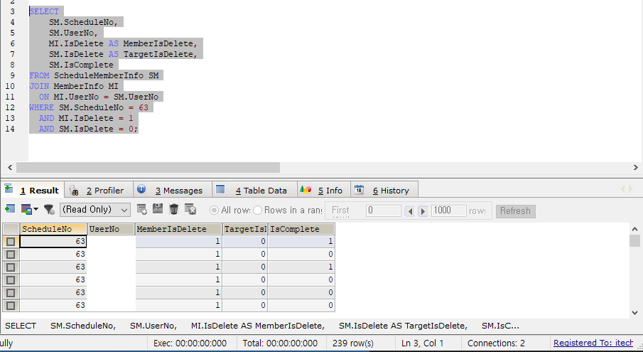
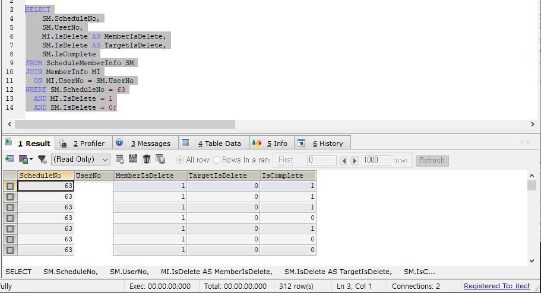

# Production Incident Case Study: Oracle-to-API Member Synchronization Data Integrity

## Overview

This case study documents a production incident that occurred after migrating a university member synchronization process from a direct Oracle database integration to a REST API-based synchronization.

Although the API synchronization successfully updated member information, one critical business workflow from the legacy Oracle implementation was omitted. This caused inactive members to remain assigned to active safety education schedules, resulting in inconsistent education statistics.

The issue was identified through production database comparison, SQL investigation, legacy code analysis, and operational verification.

---

# Environment

| Item | Value |
|------|-------|
| Platform | University Safety Education System |
| Framework | ASP.NET MVC |
| Language | C# |
| Database | MySQL |
| Synchronization | REST API |
| Previous Synchronization | Direct Oracle Database Connection |

---

# Background

The university strengthened its security policy by replacing the legacy Oracle database synchronization with a secure REST API.

The migration successfully synchronized member information, but one downstream business process was unintentionally removed.

Legacy Oracle synchronization performed two responsibilities:

1. Synchronize member information.
2. Remove inactive members from active education targets.

The new API synchronization only implemented the first responsibility.

---

# Symptoms

Education statistics suddenly changed after member synchronization.

## Current Production Statistics


```
Education Targets : 6898
Completed Members : 6378
Completion Rate   : 92.5%
```

---

## Historical Statistics


```
Education Targets : 6659
Completed Members : 6347
Completion Rate   : 95.3%
```

Although education completion records had not changed, the completion rate decreased significantly.

---

# Investigation

Database comparison showed that inactive members still existed as active education targets.

The following SQL was used to identify inconsistent records.



Result

```
MemberInfo.IsDelete = 1
ScheduleMemberInfo.IsDelete = 0
```

239 inconsistent education target records were found.

A later synchronization produced even more inconsistent records.



312 records now showed the same inconsistency.

This confirmed that the problem was cumulative rather than isolated.

---

# Root Cause Analysis

The legacy Oracle synchronization contained an additional workflow after member synchronization.


```
Oracle Synchronization
        │
        ▼
Update MemberInfo
        │
        ▼
Delete inactive education targets
        │
        ▼
Consistent statistics
```

During migration to REST API synchronization, this workflow disappeared.

The API synchronization updated only MemberInfo.

It did not update ScheduleMemberInfo.

As a result,

```
MemberInfo.IsDelete = 1
ScheduleMemberInfo.IsDelete = 0
```

became possible.

This produced stale education target records.

---

# Solution

A new cleanup method was introduced immediately after API synchronization.


The new method

```
DeleteActiveSafetyEducationMembers()
```

updates only members satisfying all conditions below.

- Member is inactive
- Safety Education (EduType = 1)
- Schedule is currently active
- Education is incomplete
- ScheduleMemberInfo.IsDelete = 0

Implementation:


---

# Operational Validation

Additional operational logging was introduced.


Example

```
API synchronization completed

Excluded inactive safety education members : 0
```

The production execution returned zero because all Safety Education schedules had already ended.

This confirmed that:

- the remediation method executed correctly
- completed historical schedules remained unchanged
- only active schedules would be affected

---

# Lessons Learned

## 1. Security migration is not only about data transport

The REST API successfully synchronized data.

However, one downstream business workflow disappeared.

Business logic parity is as important as API functionality.

---

## 2. Database comparison is essential

Historical production database snapshots quickly exposed the inconsistency.

Without comparison,

```
MemberInfo

vs

ScheduleMemberInfo
```

would have appeared individually correct.

---

## 3. Temporary filters hide symptoms

The temporary workaround

```csharp
list = list.Where(a => a.IsDelete == 0);
```

restored the expected completion percentage.

However,

it did not repair inconsistent ScheduleMemberInfo records.

---

## 4. Business-result logging is valuable

Instead of logging only technical success,

the synchronization now records

```
Excluded inactive education members : X
```

allowing operators to verify business outcomes directly.

---

# Skills Demonstrated

- Production Incident Response
- Root Cause Analysis
- Legacy System Analysis
- Oracle to REST API Migration
- Data Integrity Investigation
- SQL Troubleshooting
- ASP.NET MVC
- C#
- MySQL
- Production Logging
- Business Workflow Analysis
- Operational Verification

---

# Key Takeaways

This incident demonstrates that production migrations require more than successful API communication.

Maintaining **functional parity** between legacy and new systems is critical.

By combining SQL investigation, historical database comparison, legacy code analysis, and production validation, the missing synchronization workflow was restored without affecting historical education records.