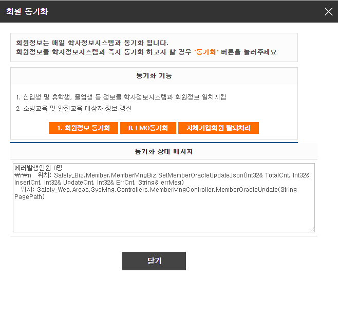

# Production Incident — HTTP 500 Member Synchronization

## Summary

Investigated and resolved a production synchronization failure caused by intermittent HTTP 500 responses from an external Student Information API.

## Technologies

- ASP.NET MVC
- C#
- MySQL
- REST API
- Newtonsoft.Json

## Result

- 34,000+ members synchronized
- Zero synchronization errors after deployment
- Improved reliability and fault tolerance

## Screenshot

