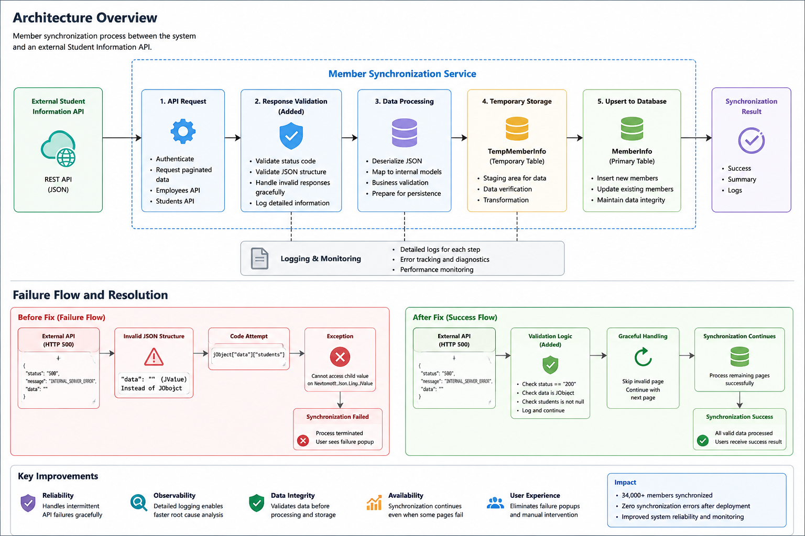

# Production Incident Report — HTTP 500 Member Synchronization Failure

## System Architecture



## Incident Date

2026-XX-XX

## System Environment

* ASP.NET MVC (.NET Framework)
* External Student Information API Integration
* MySQL
* Visual Studio
* Production Deployment Environment

---

## Summary

A production member synchronization process failed due to unexpected responses returned by an external Student Information API.

The synchronization service threw a Newtonsoft.Json exception during processing, causing the synchronization operation to terminate before completion.

Users observed a synchronization failure popup during execution.

### Error

```text
Newtonsoft.Json.Linq.JToken.get_Item(Object key)
```

Location:

```text
MemberSynchronizationService(...)
```

---

## Initial Investigation

### Verification Checklist

1. API authentication validated successfully
2. Employee API responses received successfully
3. Temporary member data populated successfully
4. Group mapping validated successfully
5. MySQL INSERT and UPDATE operations functioning normally
6. Database schema validation completed successfully

### Database Validation

```sql
SELECT COUNT(*) FROM tempmemberinfo;
```

Result:

```text
36430
```

```sql
SELECT COUNT(*) FROM memberinfo;
```

Result:

```text
128593
```

```sql
SELECT COUNT(*)
FROM tempmemberinfo t
LEFT JOIN groupinfo g
ON t.GroupCode = g.GroupCode
WHERE g.GroupCode IS NULL;
```

Result:

```text
0
```

Database integrity issues were ruled out.

---

## Investigation Process

### Phase 1 — Improve Exception Logging

Original implementation:

```csharp
catch(Exception ex)
{
    LogWrite(ex.StackTrace);
}
```

The stack trace alone did not provide sufficient information to identify the underlying cause.

Updated implementation:

```csharp
catch(Exception ex)
{
    LogWrite(ex.ToString());
    throw;
}
```

This enabled collection of complete exception details.

---

### Phase 2 — Add Diagnostic Logging

Additional logging was introduced around the Employee API processing flow.

```csharp
LogWrite("EMPLOYEE PAGE = " + i);
LogWrite("Before employees foreach");
LogWrite("After employees foreach");
LogWrite("After DataTable Deserialize");
```

Results:

```text
EMPLOYEE PAGE 1 ~ PAGE 5
Processed Successfully
```

This confirmed that employee synchronization was operating normally.

---

### Phase 3 — Analyze Student API Responses

Student API responses were reviewed in detail.

Expected response:

```json
{
  "status":"200",
  "message":"OK",
  "data":{
    "students":[...]
  }
}
```

Unexpected response:

```json
{
  "status":"500",
  "message":"INTERNAL_SERVER_ERROR",
  "data":""
}
```

---

## Root Cause Analysis

The external Student Information API intermittently returned:

```json
{
  "status":"500",
  "data":""
}
```

The synchronization service assumed that all responses contained a valid JSON object and attempted to access:

```csharp
jObject["data"]["students"]
```

However, in failure scenarios:

```csharp
jObject["data"]
```

contained:

```csharp
JValue("")
```

instead of:

```csharp
JObject
```

This resulted in the exception:

```text
Cannot access child value on Newtonsoft.Json.Linq.JValue
```

which terminated the synchronization process.

---

## Resolution

Defensive validation logic was added before processing API data.

```csharp
if (jObject["status"] == null ||
    jObject["status"].ToString() != "200")
{
    LogWrite("STUDENT API ERROR PAGE = " + i);
    LogWrite(jObject.ToString());
    continue;
}

if (!(jObject["data"] is JObject))
{
    LogWrite("STUDENT DATA INVALID PAGE = " + i);
    LogWrite(jObject.ToString());
    continue;
}

if (jObject["data"]["students"] == null)
{
    LogWrite("students is null PAGE = " + i);
    continue;
}
```

The synchronization process now validates response status and JSON structure before attempting data extraction.

---

## Validation Results

Synchronization completed successfully after deployment.

```text
Total Members      : 34,004
New Registrations  : 43
Updated Records    : 33,961
Errors             : 0
```

No synchronization failures were observed after the fix.

---

## Lessons Learned

* External APIs should never be assumed to return valid data.
* JSON structures must be validated before processing.
* Detailed logging significantly accelerates root cause analysis.
* Defensive programming improves reliability in production systems.
* Synchronization workflows should fail gracefully when dependent services return unexpected responses.

---

## Skills Demonstrated

* Production Incident Response
* Root Cause Analysis
* Reliability Engineering
* REST API Troubleshooting
* Structured Logging
* Defensive Programming
* ASP.NET MVC
* C#
* MySQL
* JSON Processing
